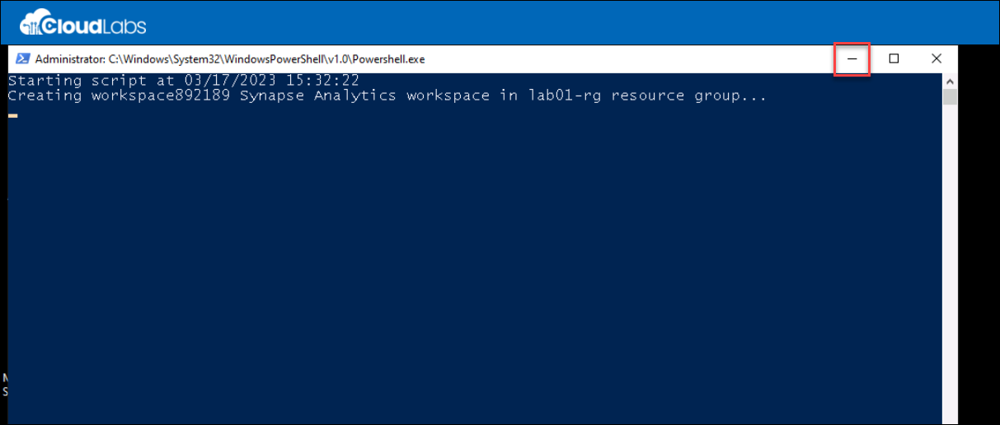
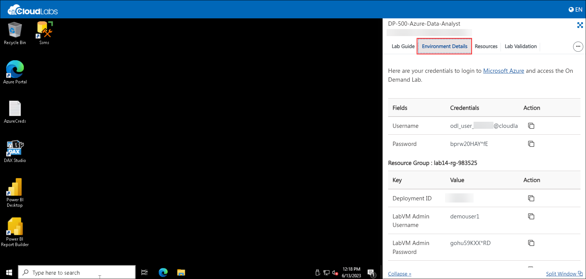
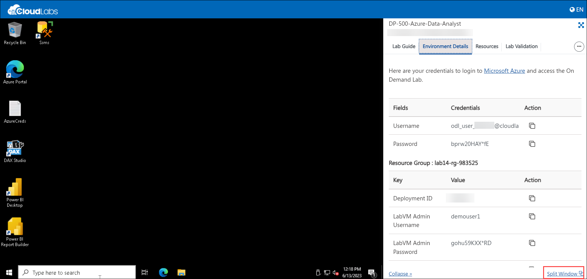
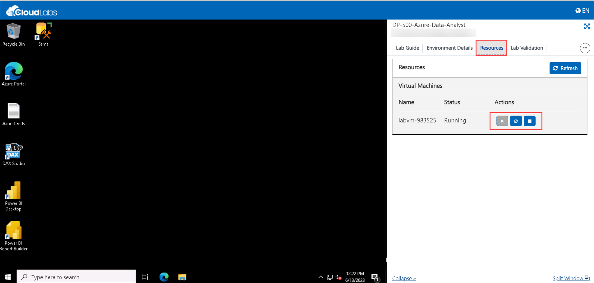
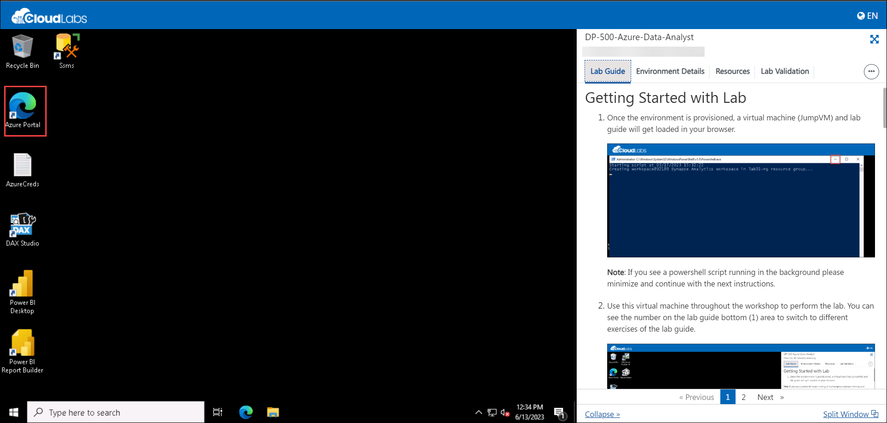

# Getting Started with Lab

1. Once the environment is provisioned, a virtual machine (JumpVM) and lab guide will get loaded in your browser. 

    
   
    >**Note**:  If you see a powershell script running in the background please minimize and continue with the next instructions.

2. Use this virtual machine throughout the workshop to perform the lab. To get the lab environment details, you can select the **Environment Details** tab.

    

1. You can also open the Lab Guide on a separate full window by selecting the **Split Window** button from the bottom right corner.

    

1. Also, you can **start, stop and restart** the virtual machines from the **Resources** tab.

    

## Login to Azure Portal
1. In the JumpVM, click on Azure portal shortcut of Microsoft Edge browser which is created on desktop.

   
  
1. On **Sign into Microsoft Azure** tab you will see login screen, in that enter following email/username and then click on **Next**. 
   * Email/Username: <inject key="AzureAdUserEmail"></inject>
   
     
     
1. Now enter the following password and click on **Sign in**.
   * Password: <inject key="AzureAdUserPassword"></inject>
   
     
      
1. If you see the pop-up **Stay Signed in?**, click No

1. If you see the pop-up **You have free Azure Advisor recommendations!**, close the window to continue the lab.

1. If a **Welcome to Microsoft Azure** popup window appears, click **Maybe Later** to skip the tour.
   
1. Now you will see Azure Portal Dashboard, click on **Resource groups** from the Navigate panel to see the resource groups.

   
   
1. You will see the Resource group containing the resources to perform the tasks given in the next page.
   
1. Now, click on the **Next** from lower right corner to move on next page.
  
   
 

