# Create a star schema model

## Overview

In this lab, you will use Power BI Desktop to develop a data model over the Azure Synapse Adventure Works data warehouse. The data model will allow you to publish a semantic layer over the data warehouse.

In this lab, you learn how to:

- Create a Power BI connection to an Azure Synapse Analytics SQL pool.

- Develop model queries.

- Organize the model diagram.

## Set up Power BI

In this task, you will set up Power BI.

1. To open Power BI Desktop, on the Desktop, select the **Power BI Desktop** shortcut.

2. Select **X** located at the top-right of the getting started window.

	

3. At the top-right corner of Power BI Desktop, if you're not already signed in, select **Sign In**. Use the lab credentials to complete the sign in process.

	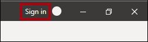
	
4. Enter the Lab username in the **Enter your email address** and click on **Continue**

	.png)
	
5. If Prompted Select **work or school** account and click contiune on Let's get you signed in page.

    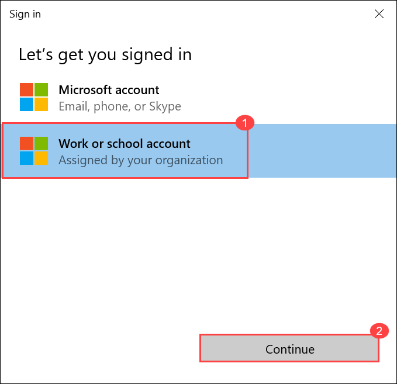


7. Complete the sign up process by providing username and password

	
6. You will be redirected to the Power BI sign-up page in Microsoft Edge. Select **contiune**.

   
   >**Note**: On the Welcome to Microsoft Edge page, select  **Start without your data**  and on the help for importing Google browsing data page, select 		      the **Continue without this data** button. Then, proceed to select  **Confirm and start browsing**  on the next page.

	
	
7. Enter the Password provided in the Environment Details tab and click on **Signin**
	
8. If stay signed in window Pops-up, select **No**

9. Enter a 10 digit phone number and select **Get started**. Select **Get started** once more. You will be redirected to Power BI.

	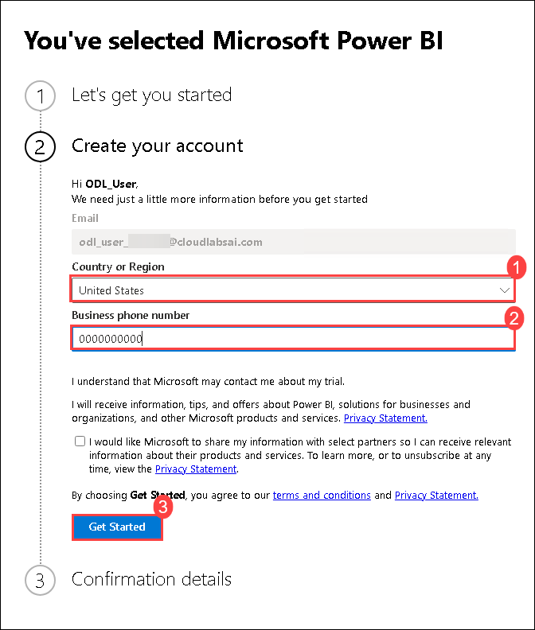
	
	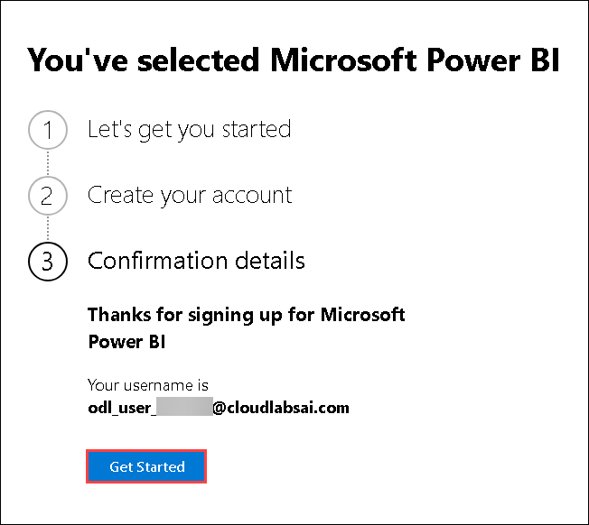

10. At the top-right, select the profile icon, and then select **Start trial**.

	.png)

11. When prompted, select **Start trial**.

	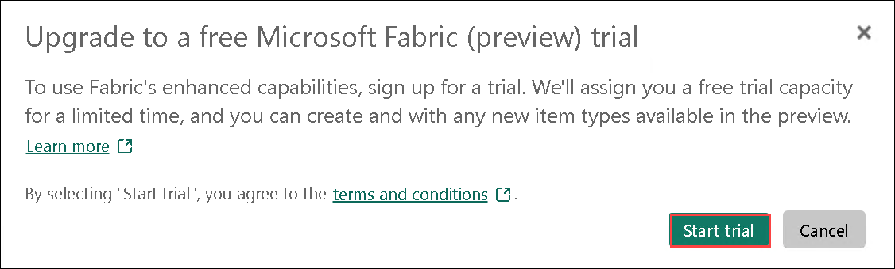

12. Do any remaining tasks to complete the trial setup.

	*Tip: The Power BI web browser experience is known as the **Power BI service**.*
	
13. Select Workspaces and **Create a Workspace**.
    
    

14. Create a workspace named **DP500-<inject key="Deployment ID" enableCopy="false" />** and select **Apply**.

    *Note: The workspace name must be unique. If you're getting an error, update the workspace name.*

    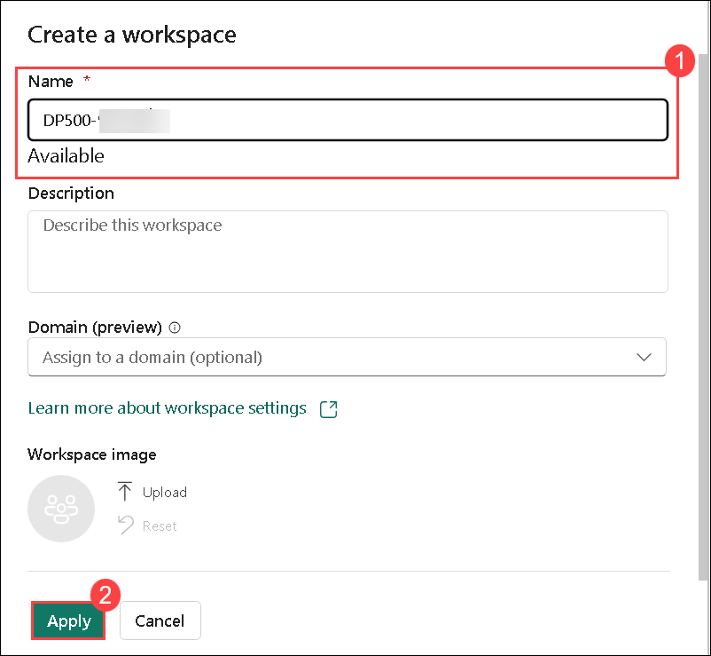

15. Navigate back to Power BI Desktop. If you see **Sign in** in the top right corner of the screen, sign-in again using the credentials provided on the Resources tab of the lab environment. If you are already signed in, proceed to the next step.

    

16. Go to Power BI Desktop and select **File** then **Options and settings** then **Options** then **Security** and under Authentication Browser check **Use my default web browser** and select **OK**. Close Power BI Desktop. Do not save your file.

	*You will open Power BI Desktop again in the upcoming exercises.*

### Start the SQL pool

In this task, you will start the SQL pool.

1. In a Microsoft Edge, go to [https://portal.azure.com](https://portal.azure.com/).

1. Use the lab credentials to complete the sign in process.

1.  In the Azure portal, in the **Search resources, services, and docs** text box at the top of the Azure portal page, Search and select **Azure Synapse Analytics**
 
1. Select your Synapse workspace.

   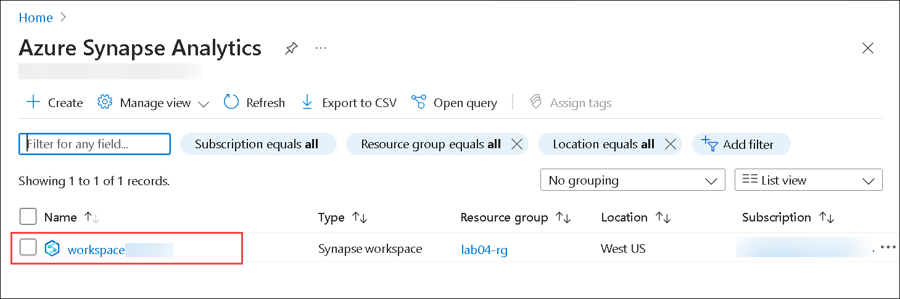

1. Scroll down on the Synapse workspace page, locate and select the dedicated SQL pool.

   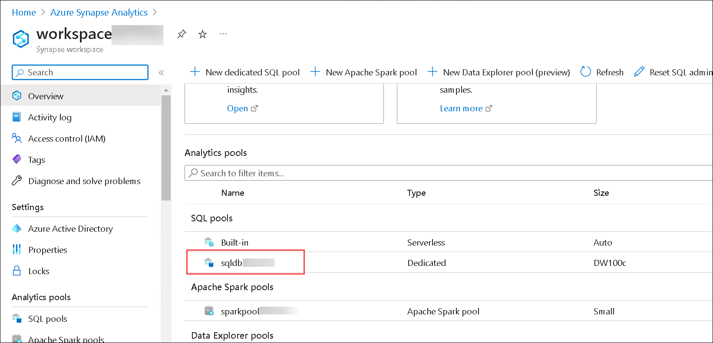

1. Resume the SQL pool.

    


	*Important: The SQL pool is a costly resource. Please limit the use of this resource when working on this lab. The final task in this lab will instruct you to pause the resource.*

### Link your Power BI workspace to Azure Synapse Analytics

In this task you will link your existing Power BI workspace to your Azure Synapse Analytics workspace.

1. From the dedicated SQL pool in the Azure Portal, select **Open in Synapse Studio** from the ribbon.

   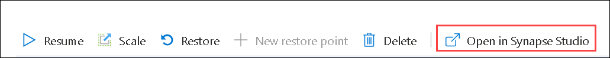

1. On the home page of Azure Synapse Studio, select **Visualize** to link your Power BI workspace.

    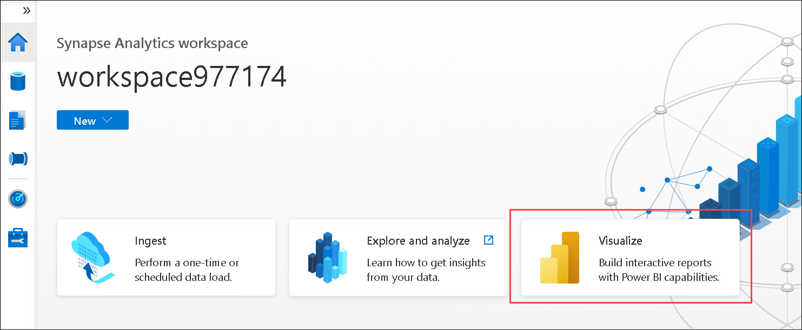

1. From the **Workspace name** dropdown, select the workspace you created in the previous task and select **Create**.

    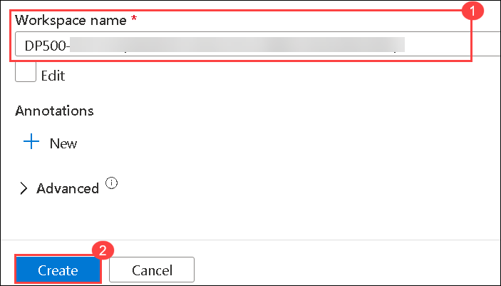

1. Navigate to **Manage**, select **Publish all** and then click on **Publish** to ensure changes are published.

    .png)
    
    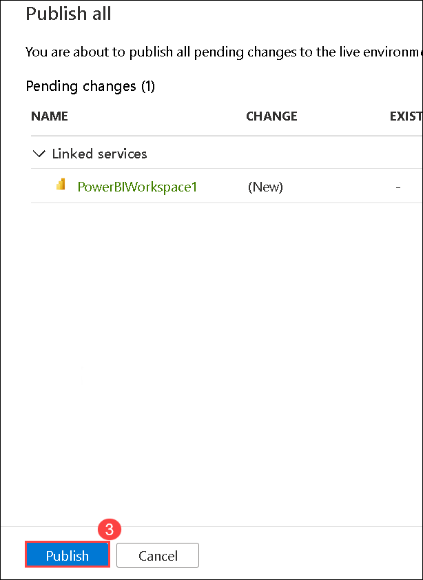

## Develop a data model

In this exercise, you will develop a DirectQuery model to support Power BI analysis and reporting of the data warehouse reseller sales subject.

### Download a dataset file

In this task, you will download a Power BI data source file from Synapse Studio.

1. In Microsoft Edge, navigate to **Synapse Studio**.

    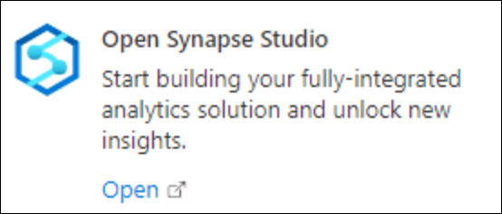

2. At the left, select the **Develop** hub.

    

3. In the **Develop** pane, expand **Power BI**, then expand the workspace, and then select **Power BI datasets**. If not present, Click **Publish all** to publish Workspace and refresh the browser.

    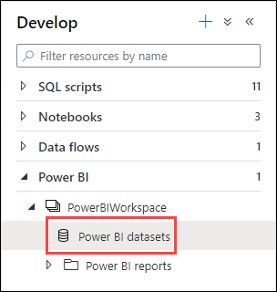

	*Note: If you don't see any data here, confirm that your dedicated SQL pool is running and that your Power BI workspace is linked to your Synapse workspace.*

4. In the **Power BI Datasets** pane, select **New Power BI Dataset**.

     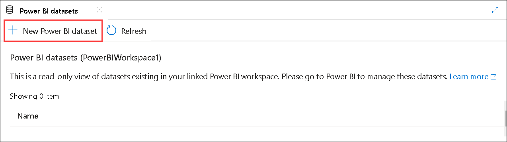


5. In the left pane, at the bottom, select **Start**.
	
6. Select your SQL pool, **sqldb-<inject key="Deployment ID" enableCopy="false" />**, and then select **Continue**.

    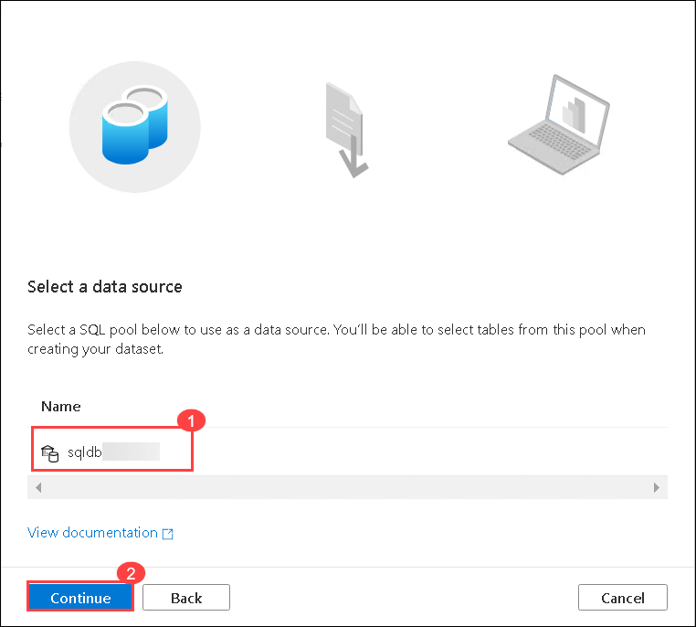

7. To download the .pbids file, select **Download**.

    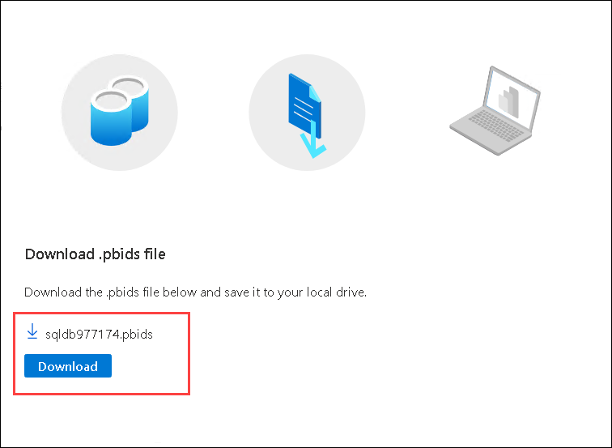

	*A .pbids file contains a connection to your SQL pool. It's a convenient way to start your project. When opened, it will create a new Power BI Desktop solution that already stores the connection details to your SQL pool.*

8. When the .pbids file has downloaded, **open it**.

	*When the file opens, it will prompt you to create queries using the connection. You will define those queries in the next task.*

### Create model queries

In this task, you will create five Power Query queries that will each load as a table to your model.

1. In Power BI Desktop, in the **SQL Server Database** window, at the left, select **Microsoft Account**.

	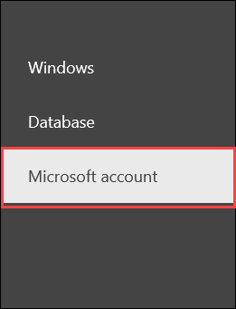
	
2. Select **Sign In**.

3. Sign in using the lab Azure credentials provided.

4. From the drop down please select the option  **workspace<inject key="DeploymentID" enableCopy="false"/>.sql.azuresynapse.net;sqldb<inject key="DeploymentID" enableCopy="false"/>** **(1)** as shown below and click Select **Connect (2)**.

   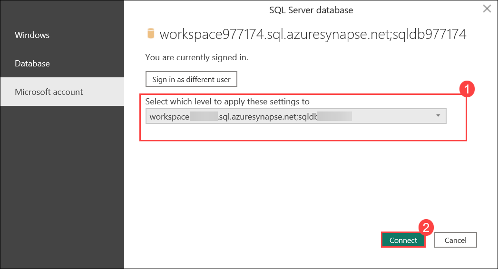
   
5. In the **Navigator** window, select (don't check) the **DimDate** table.

6. In the right pane, notice the preview result, which shows a subset of the table rows.

    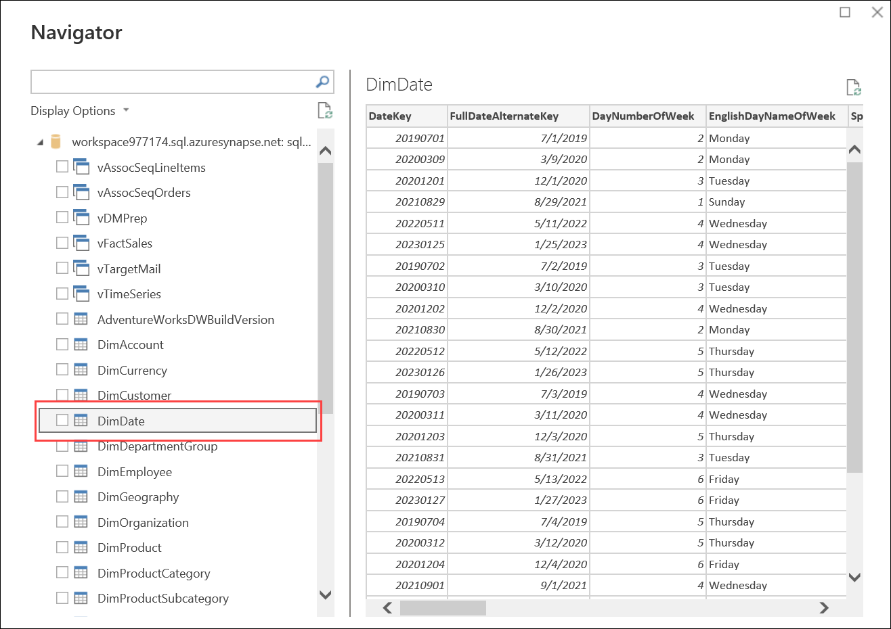
    
7. To create queries (which will become model tables), check the following seven tables:

	- DimDate

	- DimProduct
  
	- DimProductCategory
  
	- DimProductSubcategory

	- DimReseller

	- DimSalesTerritory

	- FactResellerSales

8. To apply transformations to the queries, at the bottom-right, select **Transform Data**.

     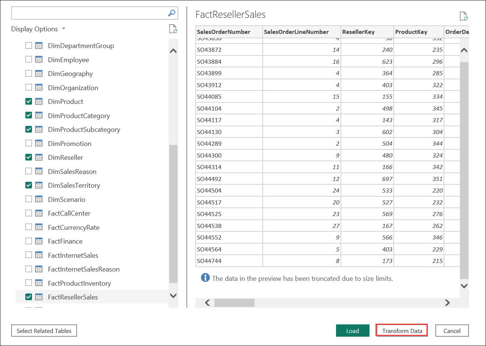

	*Transforming the data allows you to define what data will be available in your model.*


9. In the **Connection Settings** window, select the **DirectQuery** option and click **OK**.

     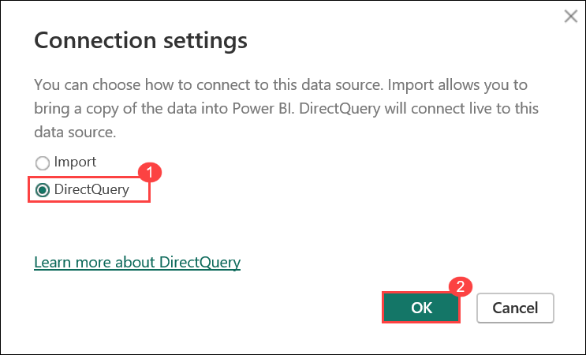

	*This decision is important. DirectQuery is a storage mode. A model table that uses DirectQuery storage mode doesn't store data. So, when a Power BI report visual queries a DirectQuery table, Power BI sends a native query to the data source. This storage mode can be used for large data stores like Azure Synapse Analytics (because it could be impractical or uneconomic to import large data volumes) or when near real-time results are required.*

11. In the **Power Query Editor** window, in the **Queries** pane (located at the left), notice there is one query for each table you checked.

     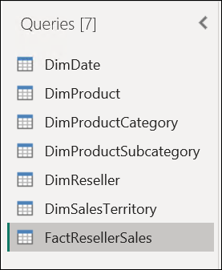


	*You will now revise the definition of each query. Each query will become a model table when it's applied to the model. You will now rename the queries, so they're described in more friendly and concise ways, and apply transformations to deliver the columns required by the known reporting requirements.*

12. Select the **DimDate** query.

      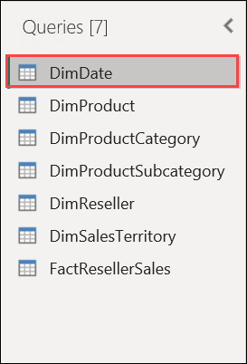


13. In the **Query Settings** pane (located at the right), to rename the query, in the **Name** box, replace the text with **Date**, and then press **Enter**.

      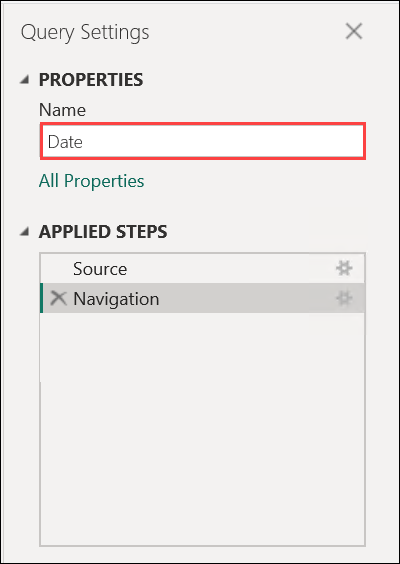


14. To remove unnecessary columns, on the **Home** ribbon tab, from inside the **Manage Columns** group, select the **Choose Columns** icon.

     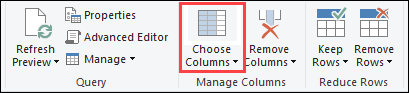

15. In the **Choose Columns** window, to uncheck all checkboxes, uncheck the first checkbox.

	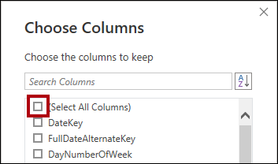


16. Check the following five columns and select **OK**.

	- DateKey

	- FullDateAlternateKey

	- EnglishMonthName

	- FiscalQuarter

	- FiscalYear

	 

	>**Note**:This selection of columns determine what will be available in your model.*


18. In the **Query Settings** pane, in the **Applied Steps** list, notice that a step was added to remove other columns.

     
     
     *Power Query defines steps to achieve the desired structure and data. Each transformation is a step in the query logic.*

19. To rename the **FullDateAlternateKey** column, double-click the **FullDateAlternateKey** column header.

20. Replace the text with **Date**, and then press **Enter**.

     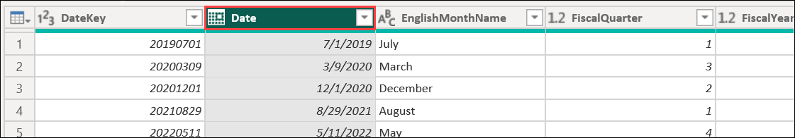

21. Notice that a new applied step is added to the query.

     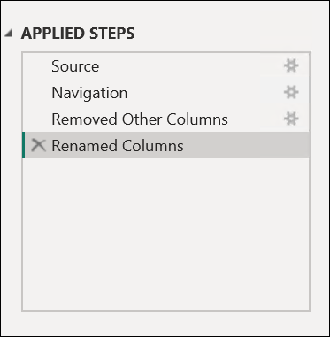

22. Rename the following columns:

	- **EnglishMonthName** as **Month**

	- **FiscalQuarter** as **Quarter**

	- **FiscalYear** as **Year**

23. To validate the query design, in the status bar (located along the bottom of the window), verify that the query has five columns.

	

	*Important: If the query design does not match, review the exercise steps to make any corrections.*

	*The design of the **Date** query is now complete.*

24. In the **Applied Steps** pane, right-click the last step, and then select **View Native Query**.

	 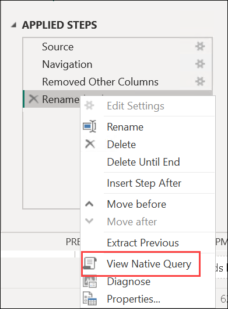

25. In the **Native Query** window, review the SELECT statement that reflects the query design.

	*This concept is important. A native query is what Power BI uses to query the data source. To ensure best performance, the database developer should ensure this query is optimized by creating appropriate indexes, etc.*

26. To close the **Native Query** window, select **OK**.

27. Select the **DimProductCategory** table. 
    
28. Rename the query to **Product Details**.

29. On the home tab of the ribbon, in the Combine group, select **Merge Queries.** 

	*Note: We are merging queries to get the product details, category and sub category. This will be used in the Product dimension.*

1. Select the **DimProductSubcategory** table from the drop down and select the **ProductCategoryKey** Column in each table. Select **OK**.

	 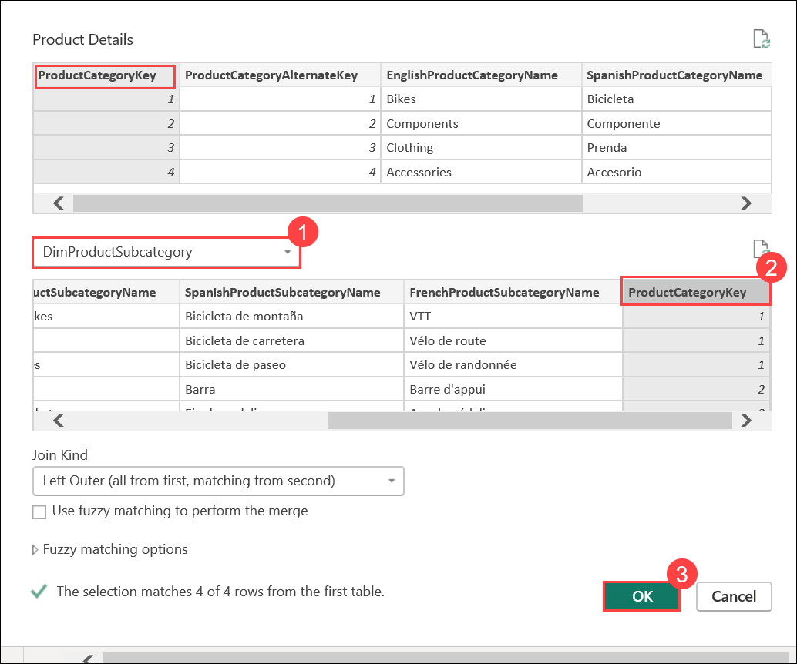

	*Note: Use the default join for this merge, which is a left outer join.*

2. Expand the **DimProductSubcategory** column. Select the **ProductSubcategoryKey** and the **EnglishProductSubcategoryName** columns. De-select **Use original column name as prefix** and select **OK**.

	 .png)

	*The Expand feature allows joining tables based on foreign key constraints in the source data. The design approach taken by this lab is to join snowflake dimension tables together to produce a denormalized representation of the data.*

1. To remove unnecessary columns, on the **Home** ribbon tab, from inside the **Manage Columns** group, select the **Choose Columns** icon.

1. In the **Choose Columns** window, to uncheck all checkboxes, uncheck the first checkbox.

1. Check the following columns and click **ok**.

   - ProductSubcategoryKey
   
   - EnglishProductCategoryName

   - EnglishProductSubcategoryName

   You should now have three columns with 37 rows.
   
3.  Select the **DimProduct** query.

      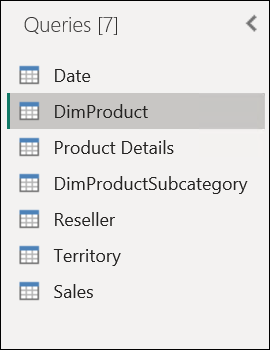

28. In the **Query Settings** pane (located at the right), to rename the query, in the **Name** box, replace the text with **Product**, and then press **Enter**.


1. On the home tab of the ribbon, in the Combine group, select **Merge Queries.** 

1. Select the **Product Details** table from the drop down and select the **ProductSubcategoryKey** column in both the Product table and the Product details table1 and select **OK**.

     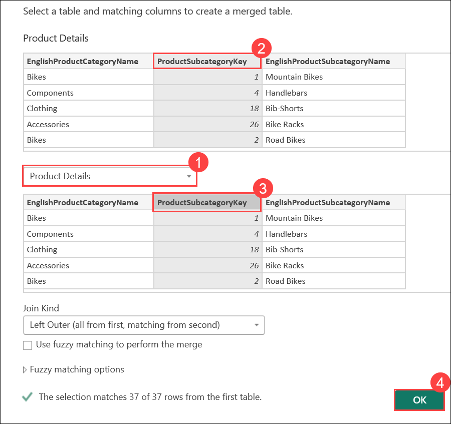

1. Expand the Product Details column and select the **EnglishProductSubcategoryName** and the **EnglishProductCategoryName** columns. 

    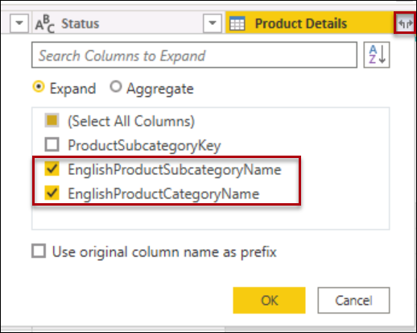

1. Select **OK**.

2.  To filter the query, in the **FinishedGoodsFlag** column header, open the dropdown menu, uncheck **FALSE** and Select **OK**.

     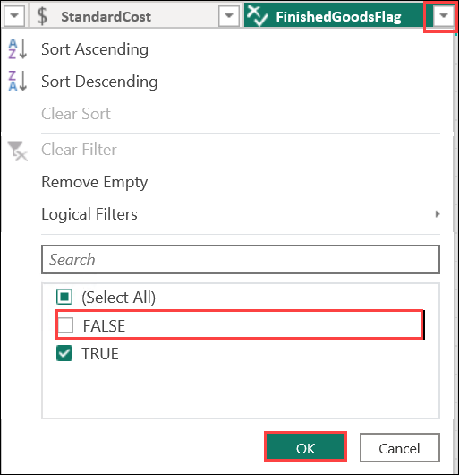
     
1. To remove unnecessary columns, on the **Home** ribbon tab, from inside the **Manage Columns** group, select the **Choose Columns** icon.

1. In the **Choose Columns** window, to uncheck all checkboxes, uncheck the first checkbox.

1. Check the following columns and click **ok**.

	- ProductKey

	- EnglishProductName

	- Color

	- EnglishProductSubcategoryName

	- EnglishProductCategoryName

37. Rename the following columns:

	- **EnglishProductName** as **Product**

	- **EnglishProductSubcategoryName** as **Subcategory**

	- **EnglishProductCategoryName** as **Category**

38. In the **Applied Steps** pane, right-click the last step, and then select **View Native Query**.

39. In the **Native Query** window, review the SELECT statement that reflects the query design.

40. To close the **Native Query** window, select **OK**.

41. Verify that the query has five columns.

	*The design of the **Product** query is now complete.*

42. Select the **DimReseller** query.

43. Rename the query as **Reseller**.

1. To remove unnecessary columns, on the **Home** ribbon tab, from inside the **Manage Columns** group, select the **Choose Columns** icon.

1. In the **Choose Columns** window, to uncheck all checkboxes, uncheck the first checkbox.

1. Check the following columns and click **ok**.

	- ResellerKey

	- BusinessType

	- ResellerName

45. Rename the following columns:

	- **BusinessType** as **Business Type** (separate with a space)

	- **ResellerName** as **Reseller**

46. Verify that the query has three columns.

	*The design of the **Reseller** query is now complete.*

47. Select the **DimSalesTerritory** query.

	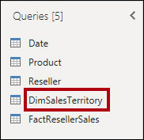

48. Rename the query as **Territory**.

1. To remove unnecessary columns, on the **Home** ribbon tab, from inside the **Manage Columns** group, select the **Choose Columns** icon.

1. In the **Choose Columns** window, to uncheck all checkboxes, uncheck the first checkbox.

1. Check the following columns and click **ok**.

	- SalesTerritoryKey

	- SalesTerritoryRegion

	- SalesTerritoryCountry

	- SalesTerritoryGroup

50. Rename the following columns:

	- **SalesTerritoryRegion** as **Region**

	- **SalesTerritoryCountry** as **Country**

	- **SalesTerritoryGroup** as **Group**

51. Verify that the query has four columns.

	*The design of the **Territory** query is now complete.*

52. Select the **FactResellerSales** query.

53. Rename the query as **Sales**.

1. To remove unnecessary columns, on the **Home** ribbon tab, from inside the **Manage Columns** group, select the **Choose Columns** icon.

1. In the **Choose Columns** window, to uncheck all checkboxes, uncheck the first checkbox.

1. Check the following columns and click **ok**.

	- ResellerKey

	- ProductKey

	- OrderDateKey

	- SalesTerritoryKey

	- OrderQuantity

	- UnitPrice

	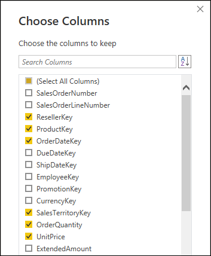

55. Rename the following columns:

	- **OrderQuantity** as **Quantity**

	- **UnitPrice** as **Price**

56. To add a calculated column, on the **Add Column** ribbon tab, from inside the **General** group, select **Custom Column**.

	 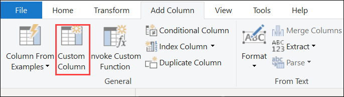


57. In the **Custom Column** window, in the **New Column Name** box, replace the text with **Revenue**.

58. In the **Custom Column Formula** box, enter the following formula:

	```
	[Quantity] * [Price]
	```

59. Select **OK**.

60. To modify the column data type, in the **Revenue** column header, select **ABC123**, and then select **Decimal Number**.

	 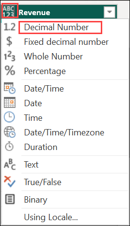

61. Review the native query, noticing the **Revenue** column calculation logic.

62. Verify that the query has seven columns.

	*The design of the **Sales** query is now complete.*

1. Right-click on the **Product Details** table and de-select **Enable load**. This will disable the load of the Product Details table to the data model, and it will not appear in the report.

	 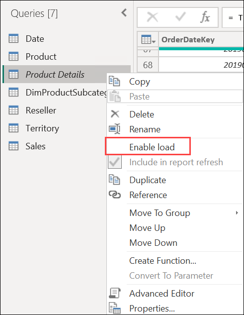

1. Repeat this step, de-selecting Enable load, for the **DimProductSubcategory** table.

63. To apply the queries, on the **Home** ribbon tab, from inside the **Close** group, select the **Close &amp; Apply** icon.

	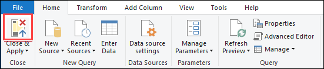

	*Each query is applied to create a model table. Because the data connection is using DirectQuery storage mode, only the model structure is created. No data is imported. The model now consists of one table for each query.*

64. In Power BI Desktop, when the queries have been applied, at the bottom-left corner in the status bar, notice that the model storage mode is DirectQuery.

	
	
65. **Congratulations** on completing the task! Now, it's time to validate it. Here are the steps:

   	- Click the **(...) icon** located at the upper right corner of the lab guide section and navigate to the **Lab Validation** Page.
   	- Hit the **Validate** button for the corresponding task.
   	- If you receive a success message, you can proceed to the next task. If not, carefully read the error message and retry the step, following the instructions in the lab guide.
   	- If you need any assistance, please contact us at [labs-support@spektrasystems.com](labs-support@spektrasystems.com).We are available 24/7 to help you out.

### Organize the model diagram

In this task, you will organize the model diagram to easily understand the star schema design.

1. In Power BI Desktop, at the left, select **Model** view.

	 

2. To resize the model diagram to fit to screen, at the bottom-right, select the **Fit to screen** icon.

	 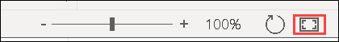
	 
3. Drag the tables into position so that the **Sales** fact table is located at the middle of the diagram, and the remaining tables, which are dimension tables, are located around the fact table.

4. If any of the dimension tables aren't related to the fact table, use the following instructions to create a relationship:

	- Drag the dimension key column (for example, **ProductKey**) and drop it on the corresponding column of the **Sales** table.

	- In the **Create Relationship** window, select **OK**.


5. Review the final layout of the model diagram.

	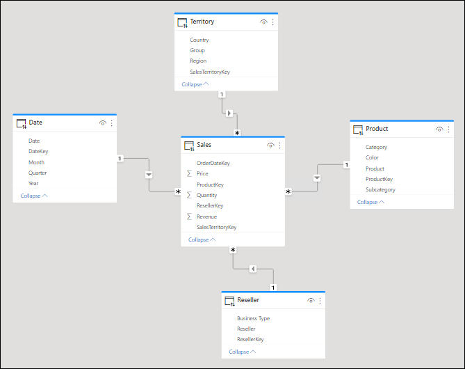

	*The creation of the star schema model is now complete. There are many modeling configurations that could now be applied, like adding hierarchies, calculations, and setting properties like column visibility.*

6. Optionally, to save the solution, at the top-left, select the disk icon.

7. In the **Save As** window, go to the **C:\LabFiles\DP-500-Azure-Data-Analyst\Allfiles\04\MySolution** folder.

8. In the **File name** box, enter **Sales Analysis**.

	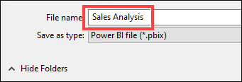

9. Select **Save**.

10. Close Power BI Desktop.

11. **Congratulations** on completing the task! Now, it's time to validate it. Here are the steps:

   	- Click the **(...) icon** located at the upper right corner of the lab guide section and navigate to the **Lab Validation** Page.
   	- Hit the **Validate** button for the corresponding task.
   	- If you receive a success message, you can proceed to the next task. If not, carefully read the error message and retry the step, following the instructions in the lab guide.
   	- If you need any assistance, please contact us at [labs-support@spektrasystems.com](labs-support@spektrasystems.com).We are available 24/7 to help you out.

### Pause the SQL pool

In this task, you will stop the SQL pool.

1. In a web browser, go to [https://portal.azure.com](https://portal.azure.com/).

2. Go to resource group and locate the SQL pool named **sqldb<inject key="DeploymentID" enableCopy="false"/>**.

3. Pause the SQL pool.

