# Exercise 1: Create a dataflow

## Overview

**The estimated time to complete the lab is 45 minutes**

In this lab, you will create a dataflow to deliver date dimension data sourced from the Azure Synapse Adventure Works data warehouse. The dataflow will provide a consistent definition of date-related data for use by the organization's business analysts.

In this lab, you learn how to:

- Use Power Query Online to develop a dataflow.

- Use Power BI Desktop to consume a dataflow.

### prerequisite Task: Start the SQL pool

In this task, you will start the SQL pool.

1. In a web browser, go to [https://portal.azure.com](https://portal.azure.com/).

1. Use the lab credentials to complete the sign in process.

1. Use the search bar to locate Azure Synapse Analytics. 

1. Select the Azure Synapse Analytics instance.
   
   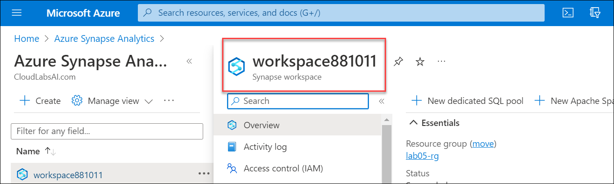

1. Locate and select the dedicated SQL pool named **sqldb<inject key="DeploymentID" enableCopy="false"/>**.
   
   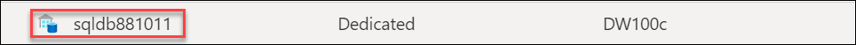

1. Resume the dedicated SQL pool.

	

	*Important: The SQL pool is a costly resource. Please limit the use of this resource when working on this lab. The final task in this lab will instruct you to pause the resource.*


### Task 1: Set up Power BI Desktop

In this task, you will set up Power BI Desktop.

1. To open File Explorer, on the taskbar, select the **File Explorer** shortcut.

   

1. Go to the **C:\LabFiles\DP-500-Azure-Data-Analyst\Allfiles\05\Starter** folder.

1. To open a pre-developed Power BI Desktop file, double-click the **Sales Analysis - Create a dataflow.pbix** file.

1. If you're not already signed in, at the top-right corner of Power BI Desktop, select **Sign In**. Use the lab credentials to complete the sign in process.

    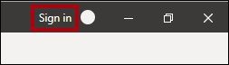
    
4. You will be redirected to the Power BI sign-up page in Microsoft Edge. Select **Continue** to complete the sign up.

	
	
	>**Note**: If not redirected, go to [https://powerbi.com](https://powerbi.com/) and use the lab credentials to complete the sign in process.

5. Enter a 10 digit phone number and select **Get started**. Select **Get started** once more. You will be redirected to Power BI.

1. At the top-right, select the profile icon, and then select **Start trial**.

	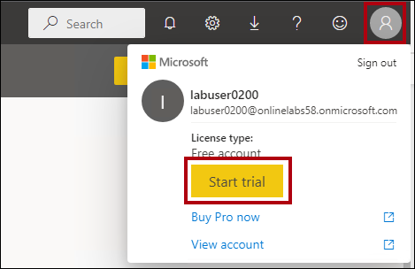

1. When prompted, select **Start trial**.

	

1. Do any remaining tasks to complete the trial setup.

	*Tip: The Power BI web browser experience is known as the **Power BI service**.*

1. Switch back to **Power BI Desktop**, To save the file, on the **File** ribbon, select **Save as**.

1. In the **Save As** window, go to the **C:\LabFiles\DP-500-Azure-Data-Analyst\Allfiles\05\MySolution** folder.

1. Go to Power BI Desktop and select **File** then **Options and settings** then **Options** then **Security** and under Authentication Browser check **Use my default web browser** and select **Ok**.

	*You will update the Power BI Desktop solution to use a dataflow to source date dimension data.*

1. **Congratulations** on completing the task! Now, it's time to validate it. Here are the steps:

   - Click the **(...) icon** located at the upper right corner of the lab guide section and navigate to the **Lab Validation** Page.
   - Hit the **Validate** button for the corresponding task.
   - If you receive a success message, you can proceed to the next task. If not, carefully read the error message and retry the step, following the instructions in the lab guide.
   - If you need any assistance, please contact us at [labs-support@spektrasystems.com](labs-support@spektrasystems.com).We are available 24/7 to help you out.

### Task 2: Create a workspace

In this task, you will create a workspace.

1. In the Power BI service, to create a workspace, in the **Navigation** pane (located at the left), select **Workspaces**, and then select **Create workspace**.

    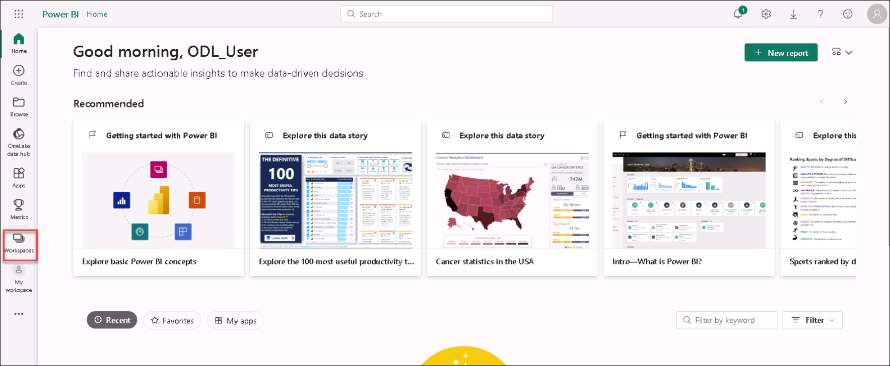

    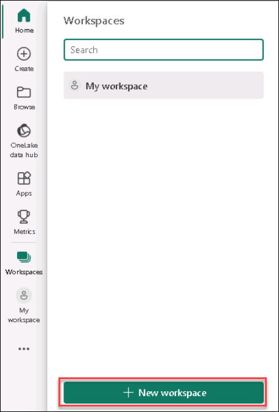

1. In the **Create a workspace** pane (located at the right), in the **Workspace name** box, enter a name for the workspace as **DP500workspace-<inject key="Deployment ID" enableCopy="false" />**.

    *The workspace name must be unique within the tenant.*

    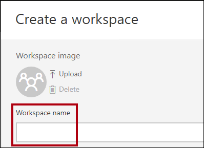

1. Select **Save**.

    

    *Once created, the workspace is opened. In a later exercise, you will create a dataflow for this workspace.*

## Exercise 2: Develop a dataflow

In this exercise, you will develop a dataflow to support Power BI model development. It will provide a consistent representation of the data warehouse date dimension table.

### Task 1: Review the data model

In this task, you will review the data model developed in Power BI Desktop.

1. Navigate back to Power BI Desktop. If you see **Sign in** in the top right corner of the screen, sign-in again using the credentials provided on the Resources tab of the lab environment. If you are already signed in, proceed to the next step.

    

1. At the left, switch to **Model** view.

    

1. In the model diagram, notice the **Date** table.

    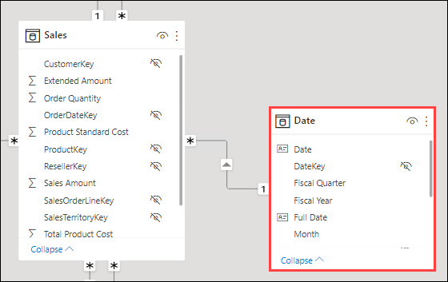

    *The **Date** table was created by the business analyst. It doesn't represent a consistent definition of date-related data, and it does not include helpful offset columns to support relative date filters. In a later exercise, you will replace this table with a new table sourced from a dataflow.*
    

### Task 2: Create a dataflow

In this task, you will create a dataflow that represents a consistent definition of date-related data.

1. Switch back to the Power BI service, select **New** and then **Dataflow**.

     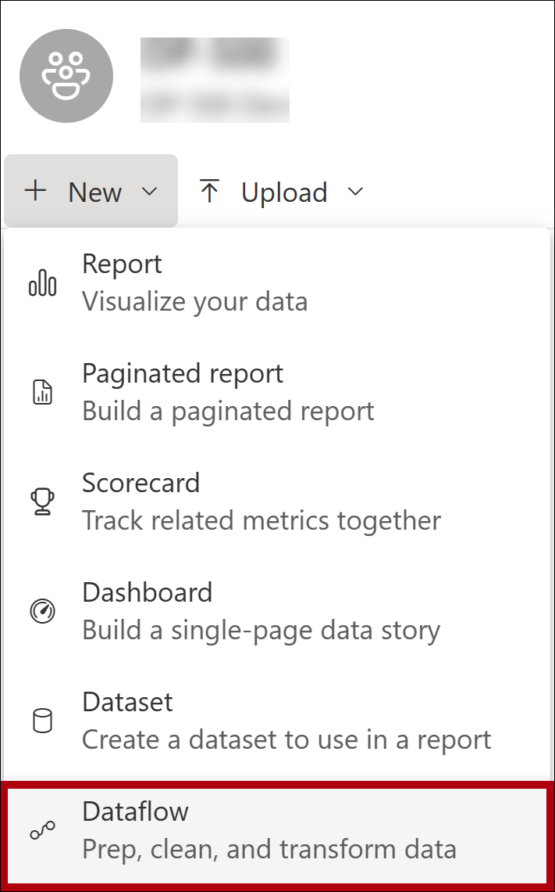

1. In the **Define new tables** tile, select **Add new tables**.

     

     *Adding new tables involves using Power Query Online to define queries.*

1. To choose a data source, search for the **Azure Synapse Analytics (SQL DW)** and select it.

      

      *Tip: You can use the Search box (located at the top-right) to help find the data source.*

1. Enter the following Synapse **Connection settings** details: 
    
    - **Server**:  **workspace<inject key="DeploymentID" enableCopy="false"/>.sql.azuresynapse.net** 
  
    - Ensure the Authentication kind is **Organizational account**. If you are prompted to sign in, use the lab provided credentials.

     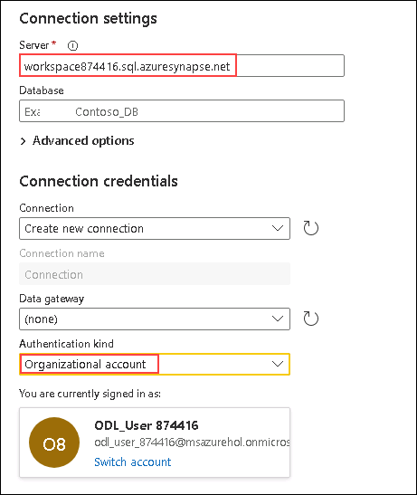
         
     >**Note**: We can also fetch the server name by signing into the azure portal and navigating to **Connection Strings** under the dedicated sql pool resource present in lab05-rg, which is well explained in the below screenshot.
    
     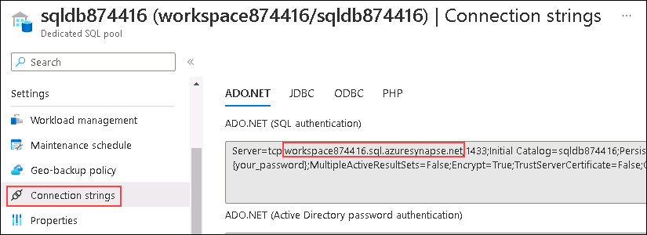
     
     >**Note**: The Server name should look similar to: *synapsewsxxxxx.sql.azuresynapse.net*

1. At the bottom-right, select **Next**.

     

1. In the Power Query navigation pane, expand the **sqldb<inject key="DeploymentID" enableCopy="false"/>** and select (do not check) the **DimDate** table.

     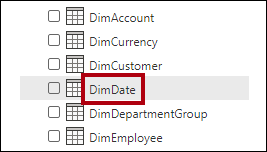

1. Notice the preview of table data.

1. To create a query, check the **DimDate** table.

      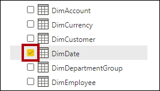

1. At the bottom-right, select **Transform data**.

      

	*Power Query Online will now be used to apply transformations to the table. It provides an almost-identical experience to the Power Query Editor in Power BI Desktop.*

1. In the **Query Settings** pane (located at the right), to rename the query, in the **Name** box, replace the text with **Date**, and then press **Enter**.

	

1. To remove unnecessary columns, on the **Home** ribbon tab, from inside the **Manage Columns** group, select the **Choose Columns** icon.

	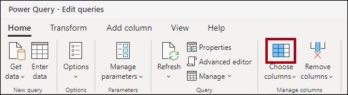

1. In the **Choose Columns** window, to uncheck all checkboxes, uncheck the first checkbox.

      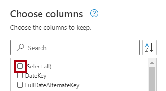

1. Check the following five columns.

	- DateKey

	- FullDateAlternateKey

	- MonthNumberOfYear

	- FiscalQuarter

	- FiscalYear

	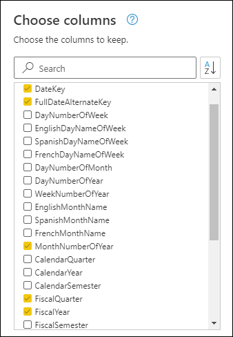

1. Select **OK**.

	

  
1. In the **Query Settings** pane, in the **Applied Steps** list, notice that a step was added to remove other columns.

	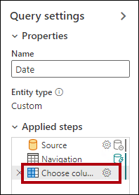

	*Power Query defines steps to achieve the desired structure and data. Each transformation is a step in the query logic.*

1. To rename the **FullDateAlternateKey** column, double-click the **FullDateAlternateKey** column header.

1. Replace the text with **Date**, and then press **Enter**.

	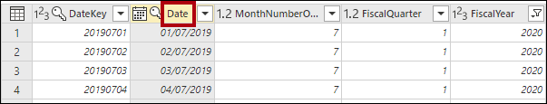

1. To add a calculated column, on the **Add Column** ribbon tab, from inside the **General** group, select **Custom Column**.

	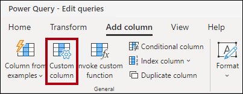
 
1. In the **Custom column** window, in the **New column name** box, replace the text with **Year**.

1. In the **Data type** dropdown list, select **Text**.

	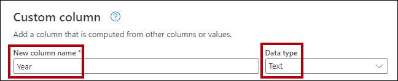

1. In the **Custom column formula** box, enter the following formula:

	*Tip: All formulas are available to copy and paste from the **C:\LabFiles\DP-500-Azure-Data-Analyst\Allfiles\05\Assets\Snippets.txt**.*

	```
	"FY" & Number.ToText([FiscalYear])
	```
	
1. Select **OK**.

	*You will now add four more custom columns.*

1. Add another custom column named **Quarter** with the **Text** data type, using the following formula:

	```
	[Year] & " Q" & Number.ToText([FiscalQuarter])
	```
	
1. Add another custom column named **Month** with the **Text** data type, using the following formula:

	```
	Date.ToText([Date], "yyyy-MM")
	```

1. Add another custom column named **Month Offset** (include a space between the words) with the **Whole number** data type, using the following formula:

	```
	((Date.Year([Date]) * 12) + Date.Month([Date])) - ((Date.Year(DateTime.LocalNow()) * 12) + Date.Month(DateTime.LocalNow()))
	```

	*This formula determines the number of months from the current month. The current month is zero, past months are negative, and future months are positive. For example, last month has a value of -1.*

1. Add another custom column named **Month Offset Filter** (include spaces between the words) with the **Text** data type, using the following formula:

	```
	if [Month Offset] > 0 then Number.ToText([Month Offset]) & " month(s) future"
	else if [Month Offset] = 0 then "Current month"
	else Number.ToText(-[Month Offset]) & " month(s) ago"
	```
	
	*This formula transposes the numeric offset to a friendly text format.*

	*Tip: All formulas are available to copy and paste from the **C:\LabFiles\DP-500-Azure-Data-Analyst\Allfiles\05\Assets\Snippets.txt**.*

1. To remove unnecessary columns, on the **Home** ribbon tab, from inside the **Manage Columns** group, select the **Choose Columns** icon.

	

1. In the **Choose Columns** window, to uncheck the following columns:

	- MonthNumberOfYear

	- FiscalQuarter

	- FiscalYear

	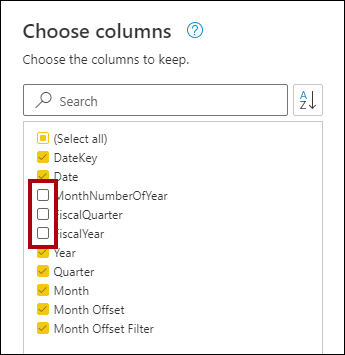

1. Select **OK**.

1. At the bottom-right, select **Save &amp; close**.

	

1. In the **Save your dataflow** window, in the **Name** box, enter **Corporate Date**.

1. In the **Description** box, enter: **Consistent date definition for use in all Adventure Works datasets**

1. Tip: The description is available to copy and paste from the **C:\LabFiles\DP-500-Azure-Data-Analyst\Allfiles\05\Assets\Snippets.txt**.

	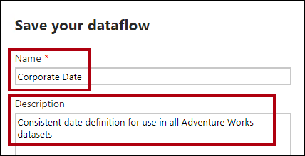

1. Select **Save**.

	

1. In the Power BI service, in the **Navigation** pane, select your workspace name.

	*This action opens the landing page for the workspace.*

1. To refresh the dataflow, hover the cursor over the **Corporate Date** dataflow, and then select the **Refresh now** icon.

	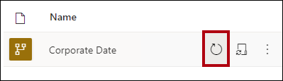

  
1. To go to the dataflow settings, hover the cursor over the **Corporate Date** dataflow, select the ellipsis, and then select **Settings**.

	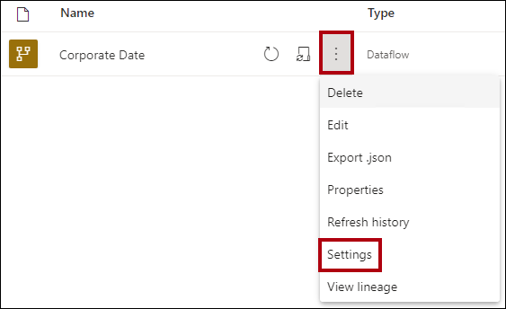

1. Notice the configuration options.

	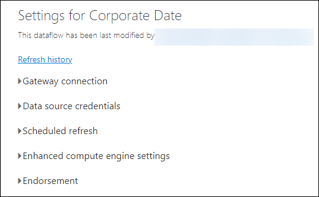

	*There are two settings that should be configured. First, scheduled refresh should be configured to update the dataflow data every day. That way, the month offsets will be calculated using the current date. Second, the dataflow should be endorsed as certified (by an authorized reviewer). A certified dataflow declares to others that it meets quality standards and can be regarded as reliable and authoritative.*

	*In addition to configuring settings, permission should be granted to all content creators to consume the dataflow.*
	
1. **Congratulations** on completing the task! Now, it's time to validate it. Here are the steps:

   - Click the **(...) icon** located at the upper right corner of the lab guide section and navigate to the **Lab Validation** Page.
   - Hit the **Validate** button for the corresponding task.
   - If you receive a success message, you can proceed to the next task. If not, carefully read the error message and retry the step, following the instructions in the lab guide.
   - If you need any assistance, please contact us at [labs-support@spektrasystems.com](labs-support@spektrasystems.com).We are available 24/7 to help you out.

## Exercise 3: Consume a dataflow

In this exercise, in the Power BI Desktop solution, you will replace the existing **Date** table with a new table that sources its data from the dataflow.

### Task 1: Remove the original Date table

In this task, you will remove the original **Date** table.

1. Switch to the Power BI Desktop solution.

1. In the model diagram, right-click the **Date** table, and then select **Delete from model**.

	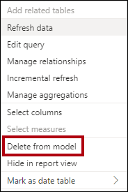

1. When prompted to delete the table, select **OK**.

	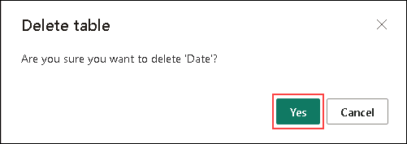


### Task 2: Add a new Date table

In this task, you will add a new **Date** table that sources its data from the dataflow.

1. On the **Home** ribbon, from inside the **Data** group, select the **Get data** icon.

	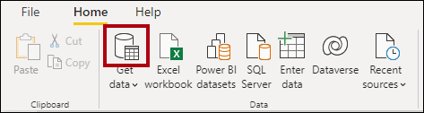

1. In the **Get Data** window, at the left, select **Power Platform**, and then select **Power BI dataflows**.

	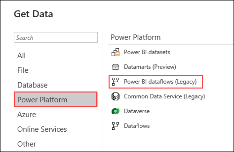

1. Select **Connect**.

	


1. In the **Power BI dataflows** window, select **Sign in**.

	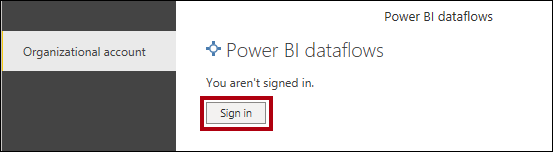

1. Use the lab credentials to complete the sign in process.

	*Important: You must use the same credentials used to sign in to the Power BI service.*

1. Select **Connect**.

	

1. In the **Navigator** window, in the left pane, expand your workspace folder, and then expand the **Corporate Date** dataflow folder.

	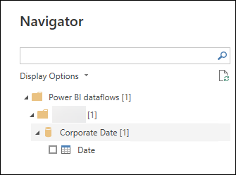


1. Check the **Date** table.

	

1. Select **Load**.

	

	*It is possible to transform the data using the Power Query Editor.*

1. When the new table is added to the model, create a relationship by dragging the **DateKey** column from the **Date** table to the **OrderDateKey** column of the **Sales** table.

	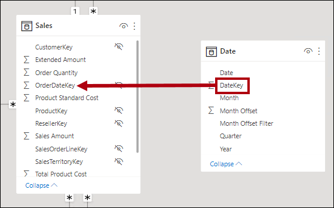

	*There are many other model configurations, like hiding columns or creating a hierarchy, that can be done.*

### Task 3: Validate the model

In this task, you will test the model by creating a simple report layout.

1. At the left, switch to **Report** view.

	

1. To add a visual to the page, in the **Visualizations** pane, select the **stack bar chart** visual.

	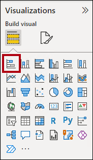

1. Resize the visual to fill the report page.

1. In the **Data** pane, expand the **Date** table, and then drag the **Month Offset Filter** field into the bar chart visual.

	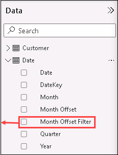

1. In the **Data** pane, expand the **Sales** table, and then drag the **Sales Amount** field into the bar chart visual.

	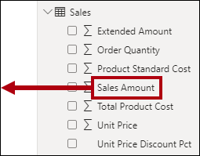

1. To sort the vertical axis, at the top-right of the visual, select the ellipsis, and then select **Sort axis** > **Month Offset Filter**.

	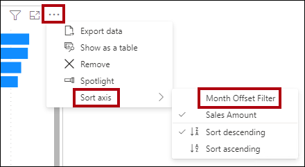

1. To ensure the month offset filter values sort chronologically, in the **Data** pane, select the **Month Offset Filter** field.

1. On the **Column Tools** ribbon tab, from inside the **Sort** group, select **Sort**, and then select **Month Offset**.

	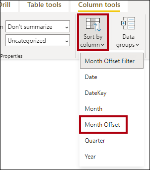

1. Review the updated bar chart visual that now sorts chronologically.

	*The main benefit of using date offset columns is that reports can filter by relative dates in a customized way. (Slicers and filters and also filter by relative date and time periods, but this behavior cannot be customized. They also don't allow filtering by quarters.)*

1. Save the Power BI Desktop file.

1. Close Power BI Desktop.

### Pause the SQL pool

In this task, you will stop the SQL pool.

1. In a web browser, go to [https://portal.azure.com](https://portal.azure.com/).

1.  Go to resource group and locate the SQL pool named **sqldb<inject key="DeploymentID" enableCopy="false"/>**.

1. Pause the SQL pool.
