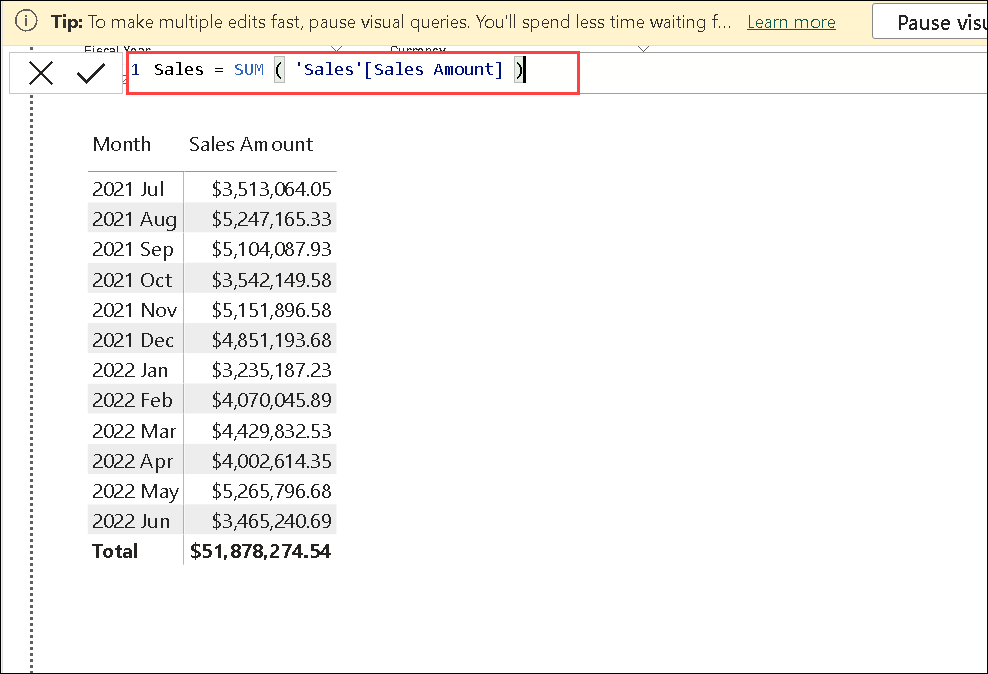
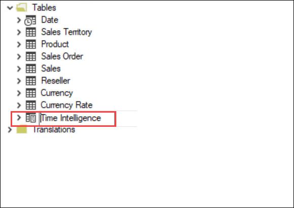
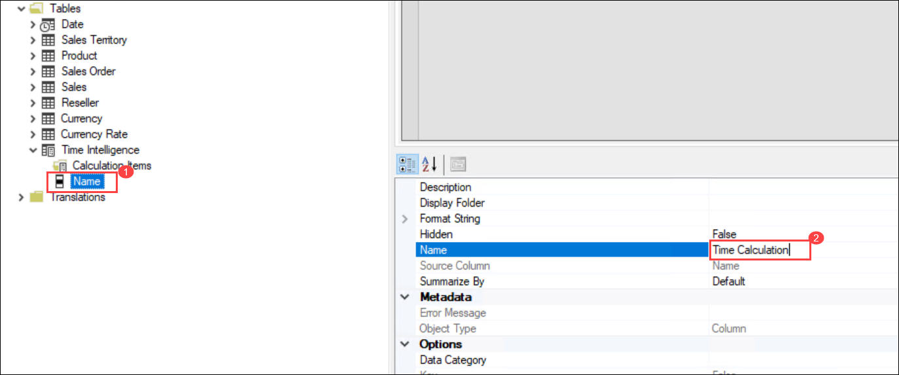
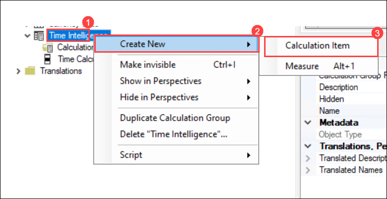
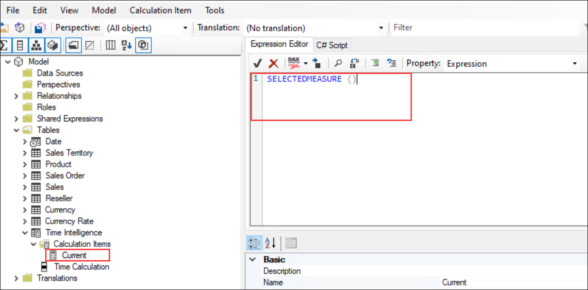
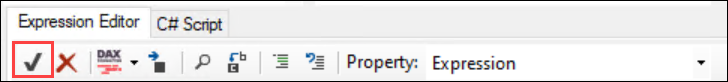
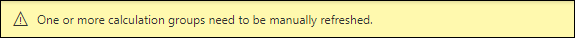
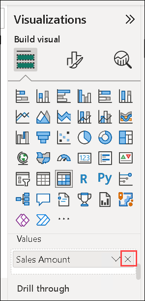
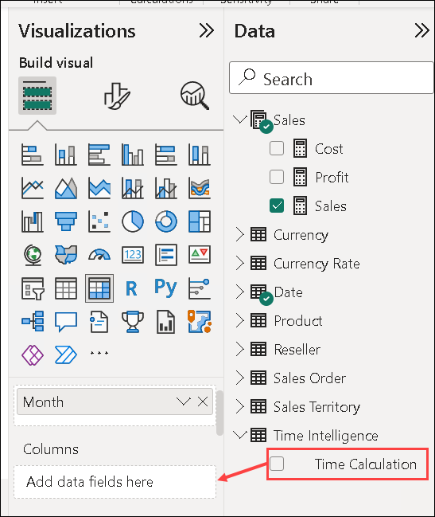

# Create calculation groups

## Overview

The estimated time to complete the lab is 45 minutes

In this lab, you will use Power BI Desktop and Tabular Editor 2 to create
calculation groups.

In this lab, you learn how to:

-   Create calculation groups.
-   Format calculation items.
-   Set calculation group precedence.
-   Configure visuals to use calculation groups.

#### Note: In this lab session, PowerBI Desktop and Tabular Editor have already been installed for the ease of execution.

### Set up Power BI Desktop

Now you'll open a pre-developed Power BI Desktop solution.

1.  In File Explorer, go to the **C:\LabFiles\DP-500-Azure-Data-Analyst\Allfiles\07\Starter** folder.

2.  To open a pre-developed Power BI Desktop file, double-click the **Sales
    Analysis - Create calculation groups.pbix** file.

3.  To save the file, on the **File** ribbon tab, select **Save as**.

4.  In the **Save As** window, go to the **C:\LabFiles\DP-500-Azure-Data-Analyst\Allfiles\07\MySolution** folder.

5.  Select **Save**.

6.  Select the **External Tools** ribbon tab.

    .png)

7.  Notice that it’s possible to launch Tabular Editor from this ribbon tab.

    

    >**Note**: In the next exercise, you will use Tabular Editor to create calculation
    groups.

### Review the data model

Review the data model to understand how calculation groups will apply to this model.

1.  In Power BI Desktop, at the left, switch to **Model** view.

    

2.  Use the model diagram to review the model design.

    

    >**Note**: The above diagram where the model comprises seven dimension tables and two fact tables. The
    **Sales** fact table stores sales order details. The **Currency Rate** fact
    table stores daily currency exchange rates for multiple currencies. It’s a
    classic star schema design.

3.  Switch to **Report** view.

    

4.  In the **Data** pane (located at the right), expand the **Sales** table to
    review the fields.

    

5.  Notice that the two **Sales** table fields are decorated with the sigma
    symbol (∑).

    >**Note**: The sigma symbol indicates that the fields will automatically summarize by using aggregation functions like sum, count, average, or others.

    >**Note**: However, when calculation groups are added to a model, this automatic
    behavior must be disabled. That means that summarization can only be
    achieved by measures, which are defined by using Data Analysis Expressions
    (DAX) formulas. In the next task, you will add measures to the model.

### Create measures

Create three sales-related measures in preparation for the creation of your calculation groups.

1.  In the **Data** pane, right-click the **Sales** table, and then select
    **New measure**.
    
2.  In the formula bar (located beneath the ribbon), replace the text with the
    following measure definition, and then press **Enter**.

    Tip: All formulas are available to copy and paste from the
    **C:\LabFiles\DP-500-Azure-Data-Analyst\Allfiles\07\Assets\Snippets.txt**.

    DAX

    ```Sales = SUM ( 'Sales'[Sales Amount] )```
    
    
      

3.  On the **Measure tools** contextual ribbon, from inside the **Formatting**
    group, set the decimals places to **2**.

    

4.  In the **Data** pane, right-click the **Sales** table, and then select
    **New measure**, Create and similarly format a second measure named **Cost** by using the
    following definition:

    DAX

    ```Cost = SUM ( 'Sales'[Total Product Cost] )```

5.  In the **Data** pane, right-click the **Sales** table, and then select
    **New measure**, create and similarly format a third measure named **Profit** by using the
    following definition:

    DAX

    ```Profit = [Sales] - [Cost]```

6.  In the **Data** pane, right-click the **Sales Amount** field, and then select **Hide**.

7.  Also hide the **Total Product Cost** field.

8.  Notice that the **Sales** table is now listed first in the **Fields** pane,
    and it is decorated with a multi-calculator icon.

    

    >**Note**: When a table comprises only visible measures, it’s presented at the top of the pane. This way, it behaves like a measure group (an object of a multidimensional model). Do not confuse this cosmetic representation of a
    tabular model with DAX calculation groups.

## Create a calculation group

Now you'll create two calculation groups. The first will support time intelligence. The second will support currency conversion.

### Create the Time Intelligence calculation group

Use Tabular Editor to create the **Time Intelligence** calculation group. It will simplify the creation of many time-related calculations, including PY (prior year), YoY (year-over-year), and YoY % (year-over-year percentage). The calculation group will allow analyzing any measure by using different Time Intelligence calculations.

   >**Note**: Power BI Desktop does not support the creation or management of calculation
groups.

   > **Tip**: All syntax is available to copy and paste from the C:\LabFiles\DP-500-Azure-Data-Analyst\Allfiles\07\Assets\Snippets.txt

1.  On the **External Tools** ribbon, select **Tabular Editor**.

    

    >**Note**: Tabular Editor opens in a new window and connects live to the data model
    hosted in Power BI Desktop. Changes made to the model in Tabular Editor
    aren’t propagated to Power BI Desktop until you save them.

2.  In the Tabular Editor window, in the left pane, right-click the **Tables (1)**
    folder, and then select **Create New (2)** \> **Calculation Group (3)**.

    

3.  In the left pane, replace the default **New calculater name** with **Time Intelligence**, and
    then press **Enter**.
    
    

4.  Expand open the **Time Intelligence** table. 
    
    >**Note**: The calculation group comprises this single column, while rows of data
    define the group of calculations. It’s a good practice to rename the column
    to reflect the subject of the calculations.

6.  select the **Name (1)** column and in the **Properties** pane (located at the bottom-right), select the
    **Name** property, and rename as **Time Calculation (2)**.

     

7.  To create a **calculation item**, right-click the **Time Intelligence (1)** table,
    and then select **Create New (2)** \> **Calculation Item (3)**.

     

8.  In the left pane, replace the default  name with **Current**, and then press
    **Enter**.

9.  In the **Expression Editor** pane (located above the **Properties** pane),
    enter the following formula:

    DAX

    ```SELECTEDMEASURE ()```

     

    >**Note**: The SELECTEDMEASURE function returns a reference to the measure that is
    currently in context when the calculation item is evaluated.

10. In the **Expression Editor** pane toolbar, select the first button to accept
    changes.

    
 
 1. To Create a second calculation item, right-click the **Time Intelligence** table,
    and then select **Create New** \> **Calculation Item**.
    
 1.  In the left pane, replace the default name with  **PY**, and then press
    **Enter**. 
    
11. In the **Expression Editor**, run the following formula:

    DAX

    ```CALCULATE ( SELECTEDMEASURE (), SAMEPERIODLASTYEAR ( 'Date'[Date] ) )```

    >**Note**: The prior year (PY) formula calculates the value for the selected measure in the prior year.
    
    
10. In the **Expression Editor** pane toolbar, select the first button to accept
    changes.
    
 1. To create a third calculation item, right-click the **Time Intelligence** table,
    and then select **Create New** \> **Calculation Item**.
    
 1.  In the left pane, replace the default name with  **YoY**, and then press
    **Enter**.

12. In the **Expression Editor**, run the following formula:


    DAX
    ```
    SELECTEDMEASURE () 
        - CALCULATE ( SELECTEDMEASURE (), 'Time Intelligence'[Time Calculation] = "PY" )
    ```
    
10. In the **Expression Editor** pane toolbar, select the first button to accept
    changes.

    >**Note**: The year-over-year (YoY) formula calculates the difference of the selected
    measure of the current year to the prior year.

 1. To create a fourth calculation item, right-click the **Time Intelligence** table,
    and then select **Create New** \> **Calculation Item**.
    
 1.  In the left pane, replace the default name with  **YoY %**, and then press
    **Enter**.

13. In the **Expression Editor**, run the following formula:


    DAX
    ```
    DIVIDE (
        CALCULATE ( SELECTEDMEASURE (), 'Time Intelligence'[Time Calculation] = "YoY" ),
        CALCULATE ( SELECTEDMEASURE (), 'Time Intelligence'[Time Calculation] = "PY" )
    )
    ```
    
 1. In the **Expression Editor** pane toolbar, select the first button to accept
    changes.
    
    >**Note**: The year-over-year percentage (YoY %) formula calculates the percentage
    change of the selected measure over the prior year.

14. In the **Properties** pane (located at the bottom-right), set the **Format String Expression** property
    to: 
    ```
    "0.00%;-0.00%;0.00%"
    ```

    **Tip**: The format string expression is available to copy and paste from the
    **C:\LabFiles\DP-500-Azure-Data-Analyst\Allfiles\07\Assets\Snippets.txt**.

    

15. Verify that the **Time Intelligence** calculation group has four calculation items.

    

16. To save the changes to the Power BI Desktop model, on the **File** menu,
    select **Save**.

    **Tip:** *It’s also possible to select the toolbar button or press **Ctrl+S**.

17. Switch to Power BI Desktop.

18. Above the report designer, notice the yellow banner.

    

19. At the right of the banner, select **Refresh now**.

    

    >**Note**: Refreshing applies the changes by creating the calculation group as a model table. It then loads the calculation items as rows of data.

20. In the **Data** pane, expand open the **Time Intelligence** table.

    

### Update the matrix visual

Now you'll modify the matrix visual to use the **Time Calculation**
column.

1.  In the report View, select the matrix visual.

2.  In the **Visualizations** pane, in the **Values** well, select **X** to
    remove the **Sales Amount** field.

      

3.  From the **Data** pane, from inside the **Sales** table, drag the
    **Sales** field into the **Values** well.

    

4.  From the **Data** pane, from inside the **Time Intelligence** table, drag
    the **Time Calculation** field into the **Columns** well.

     

5.  Verify that the matrix visual shows a grid of time-related **Sales** measure
    values grouped by month.

    

    >**Note**: The format of the values is derived from the selected measures. However,
    recall that you set the format string expression for the **YoY %** measure
    to produce a percentage format.

### Create the Currency Conversion calculation group

Now you'll create the **Currency Conversion** calculation group. It
will provide flexibility to convert the **Sales** table measures to a selected
currency. It will also apply appropriate formatting for the selected currency.

1.  In Power BI Desktop, switch to **Data** view.

     
     
2.  In the **Data** pane, select the **Currency** table.

3.  Notice the **FormatString** hidden column that contains format string
    expressions was column values.

      
      
    >**Note**: You will use a DAX expression to apply the format string of the selected
    currency.

4.  Switch to Tabular Editor.

5.  Create a calculation group named **Currency Conversion**.

    >**Note**: Due to the repetition of tasks, briefer instructions are provided. If
    necessary, you can refer to the steps in the first task of this exercise.

    

6.  Rename the default Name column as **Converted Currency**.

    

7.  Create a calculation item named **Currency Conversion** by using the
    following formula:

    DAX
    ```
    IF (
        HASONEVALUE ( 'Currency'[Currency] ),
        SUMX (
            VALUES ( 'Date'[Date] ),    CALCULATE (
                DIVIDE ( SELECTEDMEASURE (), MAX ( 'Currency Rate'[EndOfDayRate] ) )
            )
        )
    )
    ```
    
    >**Note**: When there’s only one currency in the filter context, the formula sums daily values of the selected measure that are divided by that day’s end of day rate.

8.  In the **Properties** pane, set the **Format String Expression** property to the following formula:

    DAX
    ```
    SELECTEDVALUE ( 'Currency'[FormatString] )
    ```
    
    >**Note**: This formula returns the format string of the selected currency. This way,
    formatting is dynamically driven by the data in the **Currency** dimension
    table.

9.  To save the changes to Power BI Desktop model, save the current changes in the Tabular Editor - **Ctrl+S**

10. Switch to Power BI desktop and refresh the changes.

    

11. Switch to **Report** view.

    
    
12. Select the matrix visual.

13. From the **Data** pane, from within the **Currency Conversion** table,
    drag the **Converted Currency** field into the **Filters** pane, into the
    **Filter on this visual** group.

    

14. In the filter card, check the **Currency Conversion** value.

    

15. Notice that the value formats update to clearly describe US dollar amounts.

    

16. In the **Currency** slicer, select a different currency, and then in the
    matrix visual, notice the updated values and formatting.

17. Revert the **Currency** slicer back to **US Dollar**.

    

18. Notice, however, that the **YoY %** values are no longer percentages.

    >**Note**: There’s a problem. Both the **Time Intelligence** and **Currency
    Conversion** calculations groups are applied, but the calculation order is
    incorrect. Presently, the **YoY %** calculation happens, then the currency
    conversion adds daily calculation results over the month. To produce the
    correct result, the calculation order must be reversed. You can control
    calculation order by setting precedence values.

### Modify calculation group precedence

Now you will modify the calculation group precedence of the two
calculation groups.

1.  Switch to Tabular Editor.

2.  In the left pane, select the **Time Intelligence** calculation group.

    

3.  In the **Properties** pane, set the **Calculation Group Precedence**
    property to **20**.

    

    >**Note**: The higher the value the higher the precedence of application. So, the
    calculation group with the higher precedence is applied first.

4.  Set the calculation group precedence for the **Currency Conversion**
    calculation group to **10**.

    

    >**Note**: These configurations will ensure the **Time Intelligence** calculations
    happen later.

5.  To save the changes to Power BI Desktop model, save the current changes in the Tabular Editor - **Ctrl+S**

6.  Switch to Power BI Desktop.

7.  Notice that the **YoY %** values are now percentages.

    
    

### Finish up

In this task, you'll finish up.

1.  Save the Power BI Desktop file.

    
    
2.  Close Power BI Desktop.

    **Congratulations** on completing the task! Now, it's time to validate it. Here are the steps:
    > - Navigate to the Lab Validation Page, from the upper right corner in the lab guide section.
    > - Hit the Validate button for the corresponding task. If you receive a success message, you can proceed to the next task. 
    > - If not, carefully read the error message and retry the step, following the instructions in the lab guide.
    > - If you need any assistance, please contact us at labs-support@spektrasystems.com. 
   
3.  Close Tabular Editor.
