# Create a composite model

## Overview

**The estimated time to complete the lab is 30 minutes.**

In this lab, you will create a composite model by adding a table to a pre-developed DirectQuery model.

In this lab, you learn how to:

- Create a composite model.

- Create model relationships.

- Create measures.

### Task-1: Set up Power BI Desktop

In this task, you will open a pre-developed Power BI template file.

1. To open File Explorer, on the taskbar, select the **File Explorer** shortcut.

    

1. Go to the **C:\LabFiles\DP-500-Azure-Data-Analyst\Allfiles\08\Starter** folder.

1. To open a pre-developed Power BI Desktop file, double-click the **Sales Analysis - Create a composite model.pbit** file. 

1. If prompted to approve a potential security risk, select **OK**.

1. Enter the SQLServerInstance, SqlServerDatabase, and Culture as provided below. Select **Load**.

    SqlServerInstance = ```localhost```

    SqlServerDatabase = ```AdventureWorksDW2022-DP500```

    Culture = ```en```

    

1. In the SQL server database connection prompt, select **Connect**.

    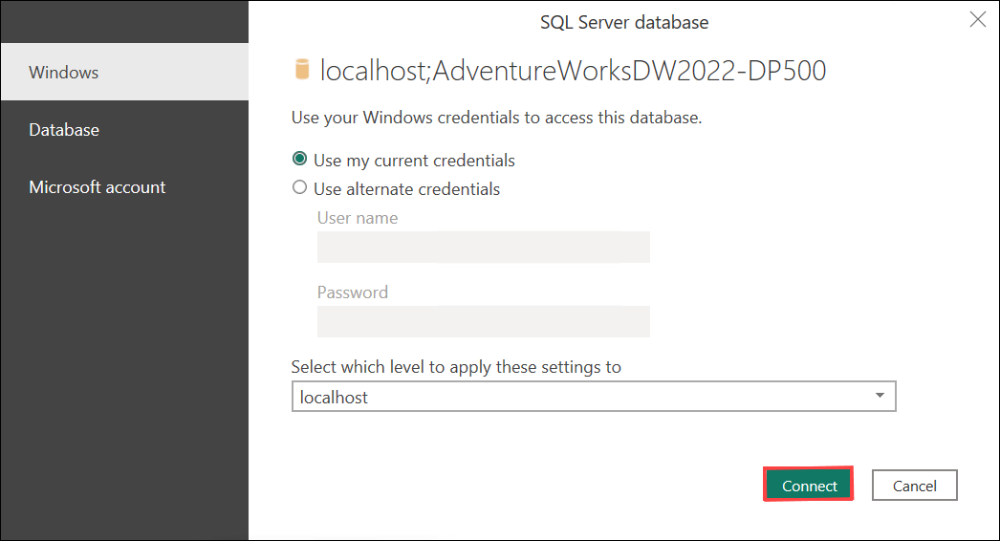

1. In the Encryption Support window, select **OK**.

1. In the Native Database Query window, select **Run**.

1. Save the file. On the **File** ribbon tab, select **Save as**.

1. In the **Save As** window, go to the **C:\LabFiles\DP-500-Azure-Data-Analyst\Allfiles\08\MySolution** folder. The file name is **Sales Analysis - Create a composite model.pbix**.

1. Select **Save**.

### Task-2: Review the report

In this task, you will review the pre-developed report.

1. In Power BI Desktop, at the bottom right corner in the status bar, notice that the storage mode is DirectQuery.

    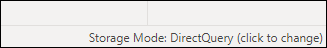

    >**Note**: A DirectQuery model comprises tables that use DirectQuery storage mode. A table that uses DirectQuery storage mode passes queries through to the underlying data source. Data modelers often use this storage mode to model large volumes of data. In this instance, the underlying data source is a SQL Server database.

1. Review the report design.

    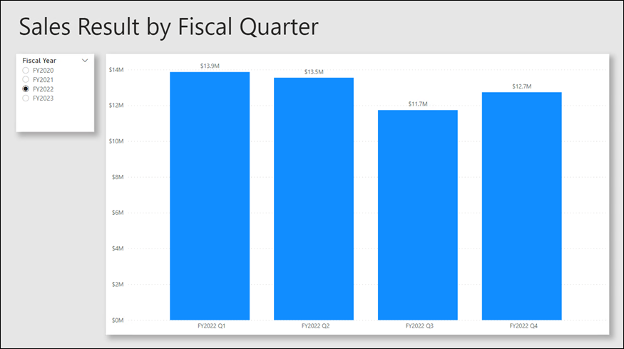

    >**Note**: This report page has a title and two visuals. The slicer visual allows filtering by a single fiscal year, while the column chart visual displays quarterly sales amounts. You will improve upon this design by adding sales targets to the column chart visual.*

1. In the **Fiscal Year** slicer, select **FY2021**.

     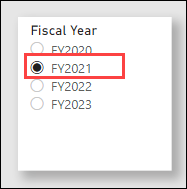

    >**Note**: It's important to understand that slicer selections change the filters applied to the column chart visual. Power BI refreshes the column chart visual. That involves retrieving data from the source database. That way, the column chart visual shows the latest source data. (Some report-level caching may occur, meaning the report may reuse previously queried data).

### Task-3: Review the data model

In this task, you will review the pre-developed data model.

1. Switch to **Model** view.

     

1. Use the model diagram to review the model design.

     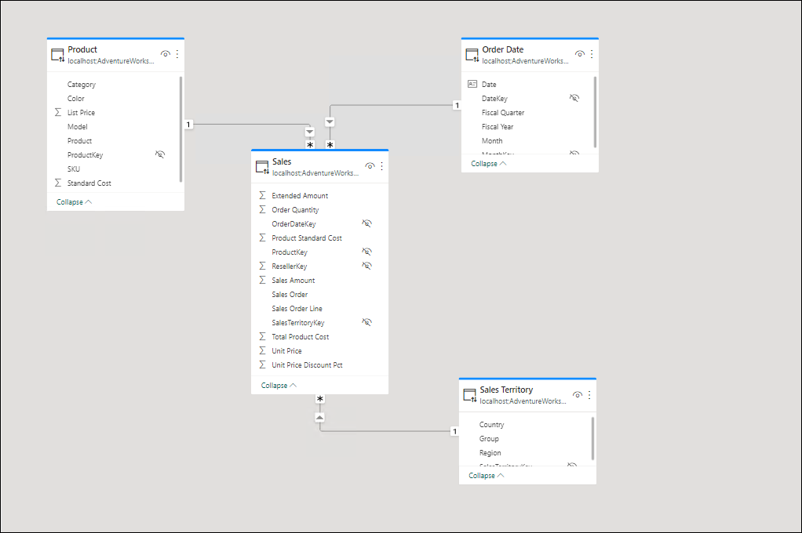
     
    >**Note**: The model comprises three dimension tables and one fact table. The **Sales** fact table represents sales order details. It's a classic star schema design. The bar across the top of each table indicates it uses DirectQuery storage mode. Because each table has a blue bar, it indicates all tables belong to the same source group.

    >**Note**: You will extend the model with another fact table to support analyzing sales target facts too.

## Create a composite model

In this exercise, you will add an import table that will convert the DirectQuery model to a composite model.

>**Note**: A composite model comprises more than one source group.

### Task-4: Add a table

In this task, you will add a table that stores sales targets sourced from an Excel workbook.

1. On the **Home** ribbon tab, from inside the **Data** group, select **Excel workbook**.

     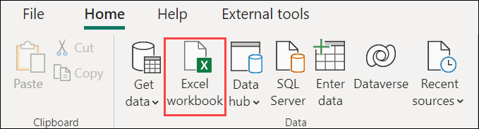

1. In the **Open** window, go to the **C:\LabFiles\DP-500-Azure-Data-Analyst\Allfiles\08\Assets** folder.

1. Select the **SalesTargets.xlsx (1)** file and select **Open (2)**.

    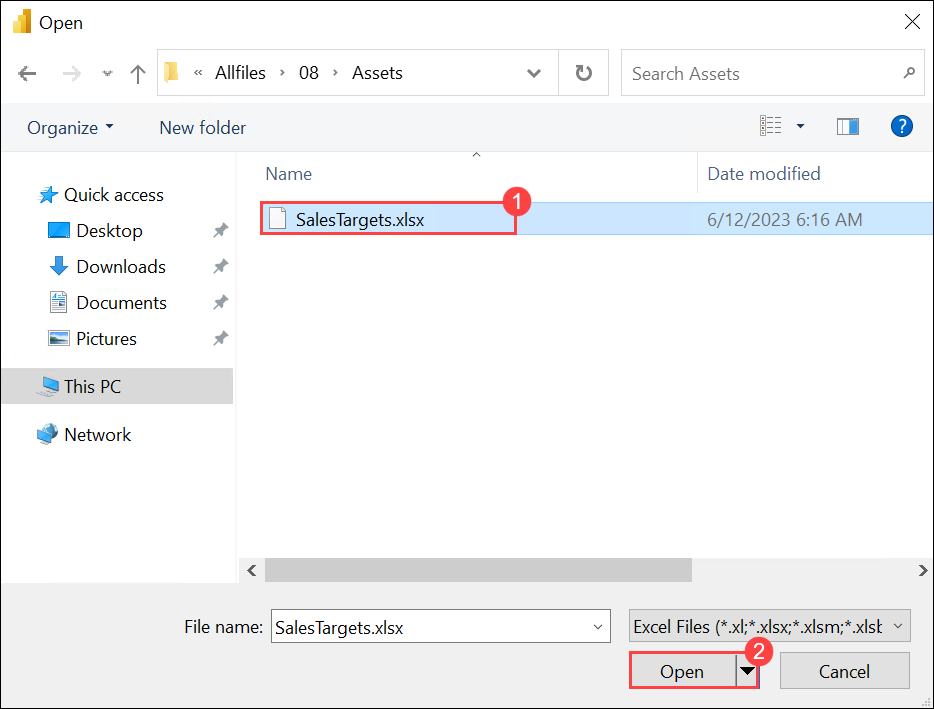

1. In the **Navigator** window, check the **Targets** table.

   .png)

1. In the preview pane (located at the right), notice that the table comprises **three columns (1)**, and each row of the table represents a fiscal quarter, sales region, and a target sales amount and select **Transform Data (2)**.

    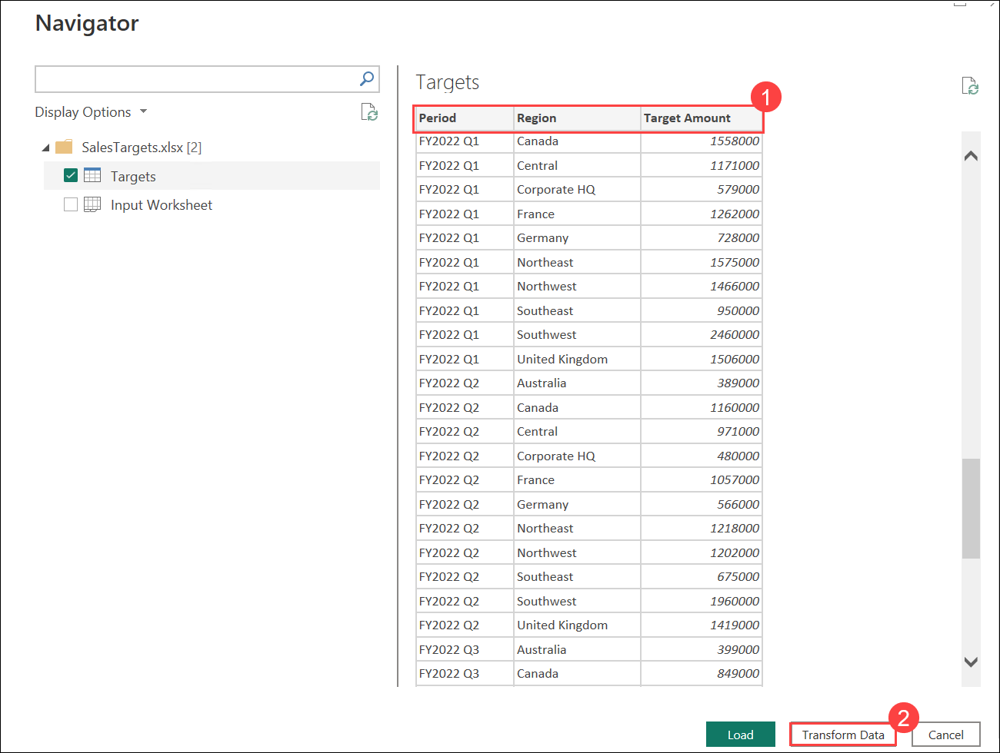

    >**Note**: You will import this data to add a table to the DirectQuery model. Because it isn't possible to connect to an Excel workbook using DirectQuery, Power BI will import it.

1. In the Power Query Editor window, to rename the first column, double-click the **Period** column header.

1. Rename the column as **Fiscal Quarter**, and then press **Enter**.

    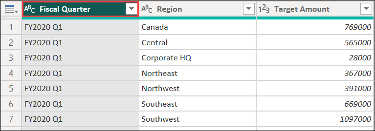
    
1. To modify the data type of the third column, in the **Target Amount** column header, select the data type icon **(123) (1)**, and then select **Fixed Decimal Number (2)**.

     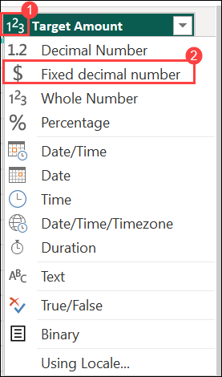

1. To apply the query, on the **Home** ribbon tab, from inside the **Close** group, select the **Close &amp; Apply** icon.

     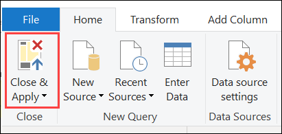
     
1. If prompted about a potential security risk, read the message, and then select **OK**.

1. In Power BI Desktop, when the load process completes, in the model diagram, position the new table directly beneath the **Order Date** table.

   >**Note**: The table may be out of view. If this is the case, scroll horizontally to reveal the table.*

1. Notice that the **Targets** table doesn't have a blue bar across the top.

     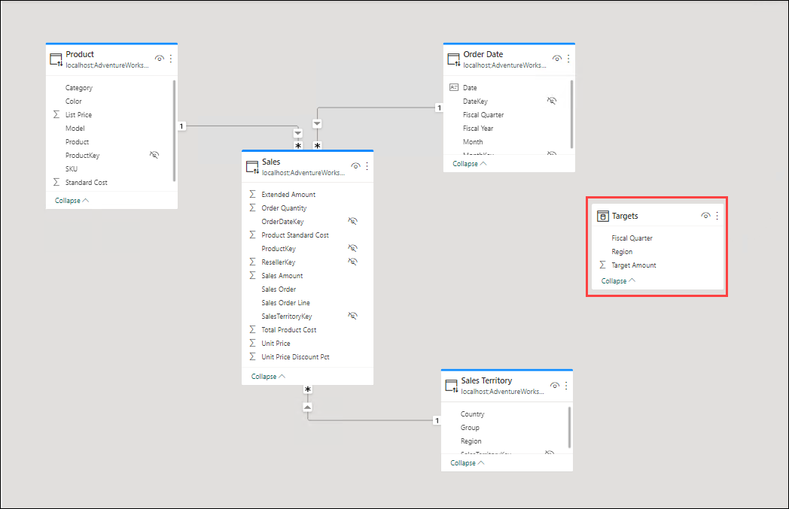

     >**Note**: The absence of a bar indicates the table belongs to the import source group.

### Task-5: Create model relationships

In this task, you will create two model relationships.

1. To create a relationship, from the **Sales Territory** table, drag the **Region** column and drop it on to the **Region** column of the **Targets** table.

    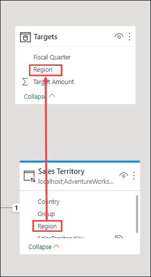

1. In the **Create relationship** window, notice that the **Cardinality** dropdown list is set to **One to many (1)** and select **OK (2)**.

   >**Note**: The **Region** column in the **Sales Territory** table contains unique values, while the **Region** column in the **Targets** table contains duplicate values. This one-to-many cardinality is common for relationships between dimension and fact tables.

    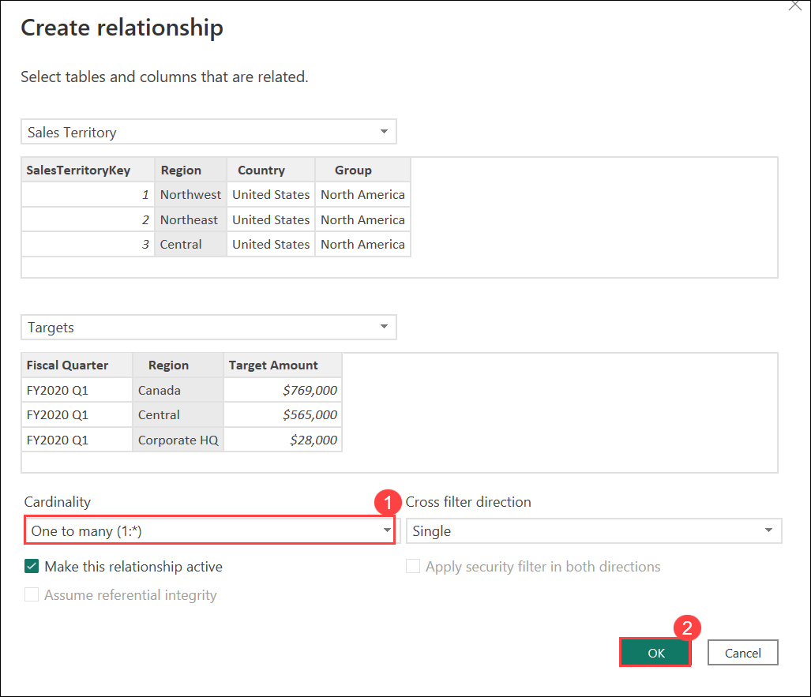

1. In the model diagram, notice that a relationship now exists between the **Sales Territory** and **Target** tables.

1. Notice also that the relationship line look different to the other relationship lines.

    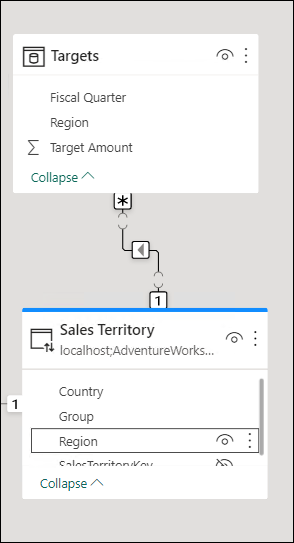

    >**Note**: The "disconnected" line indicates that the relationship is a limited relationship. A model relationship is limited when there's no guaranteed "one" side. In this case, it's because the relationship spans source groups. At query time, relationship evaluation can differ for limited relationships. For more information, see [Limited relationships](https://docs.microsoft.com/power-bi/transform-model/desktop-relationships-understand).

1. Create another relationship, this time relating the **Fiscal Quarter** column of the **Order Date** table to the **Fiscal Quarter** column of the **Targets** table.

    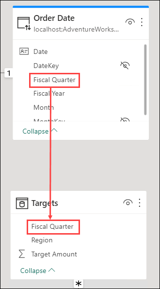

1. In the **Create relationship** window, notice that the **Cardinality** dropdown list is set to **Many to many**.

   >**Note**: Because both columns contain duplicate values, Power BI Desktop automatically sets the cardinality to many to many. However, the default cross filter direction is incorrect.

1. In the **Cross filter direction** dropdown list, select **Single (Order Date filters Targets)**.

     .png)
     
     >**Note**: It's common that dimension tables filter fact tables. In this model design, it isn't necessary (or efficient) to propagate filters from the fact table to the dimension table.

1. Select **OK**.

### Task-6: Set model properties

In this task, you will set model properties of the new table.

1. In the **Targets** table, select the **Fiscal Quarter** column.

1. While pressing the **Ctrl** key, also select the **Region** column.

1. In the **Properties** pane, set the **Is hidden** property to **Yes**.

    

1. In the **Targets** table, select the **Target Amount** column.

1. In the **Properties** pane, in the **Formatting** section, set the **Decimal places** property to **2**.

    

### Task-7: Add measures

In this task, you will add two measures to allow the analysis of sales target variance.

1. Switch to **Report** view.

    

1. To create a measure, in the **Data** pane (located at the right), right-click the **Targets** table, and then select **New measure**.

1. In the formula bar, enter the following measure definition.

    >**Tip** : All measure definitions are available to copy and paste from the* **C:\LabFiles\DP-500-Azure-Data-Analyst\Allfiles\08\Assets\Snippets.txt** file.

    ```
    Variance = SUM ( 'Sales'[Sales Amount] ) - SUM ( 'Targets'[Target Amount] )
    
    ```
    
     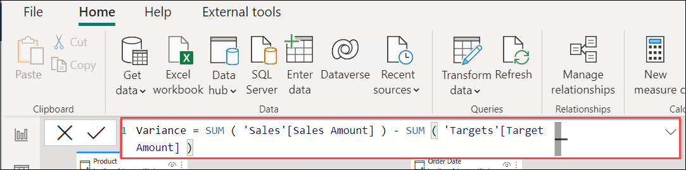
     
     >**Note**: *The measure named **Variance** subtracts the sum of **Target Amount** from the sum of **Sales Amount**.

1. On the **Measure Tools** contextual ribbon tab, from inside the **Formatting** group, in the decimal places box, enter **2**.

    .png)
    
    >**Note**: If you don't find **Measure Tools** under ribbon tab, in the **Properties** pane, in the **Formatting** section, set the **Decimal places** property to **2**.
            
    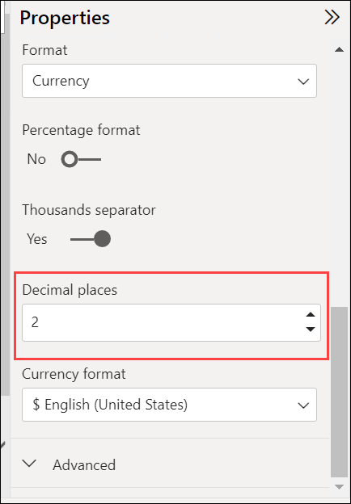
      
1. Create another measure using the following measure definition.


    ```
    Variance Margin =

    DIVIDE (

    [Variance],

    SUM ( 'Targets'[Target Amount] )

    )
    
    ```


    >**Note**: The measure named **Variance Margin** uses the DAX [DIVIDE](https://docs.microsoft.com/dax/divide-function-dax) function to divide the **Variance** measure by the sum of the **Target Amount** column.

1. On the **Measure Tools** contextual ribbon tab, from inside the **Formatting** group, in the **Format** dropdown list, select **Percentage**.

    .png)
    
    >**Note**:If you don't find **Measure Tools** under ribbon tab, in the **Properties** pane, in the **Formatting** section, set the **Format** dropdown list, select **Percentage**.

     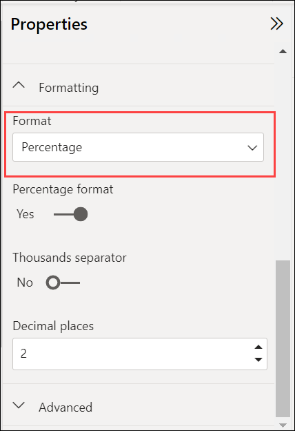
     
1. In the **Data** pane, inside the **Targets** table, verify that there are two measures.

   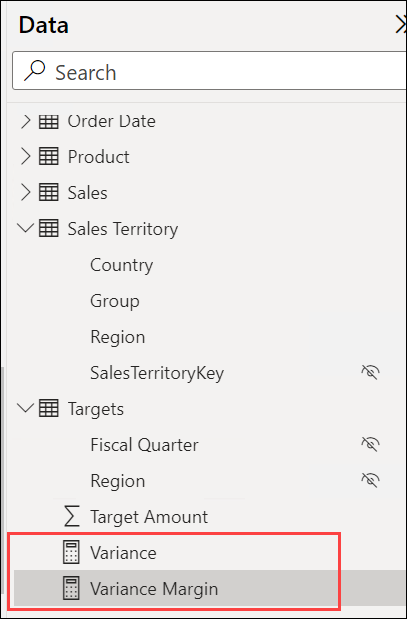
   
   
### Task-8: Update the report layout

In this task, you will update the report to use the new measures.

1. Switch to report

   
 
1. In the report, select the column chart visual.

1. From the **Data** pane, drag the **Target Amount** field into the **Visualizations** pane, inside the **Y-Axis** cell, directly beneath the **Sales Amount** field.

    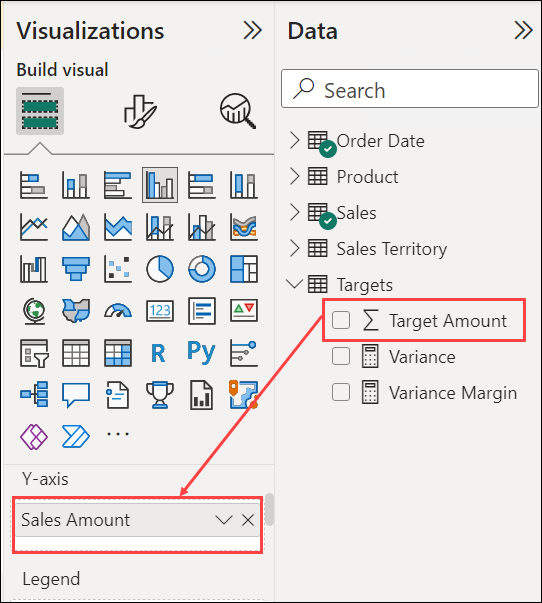
    
1. Notice that the column chart visual now shows sales and target amounts.

1. Drag the two measures into the **Tooltips** well.

   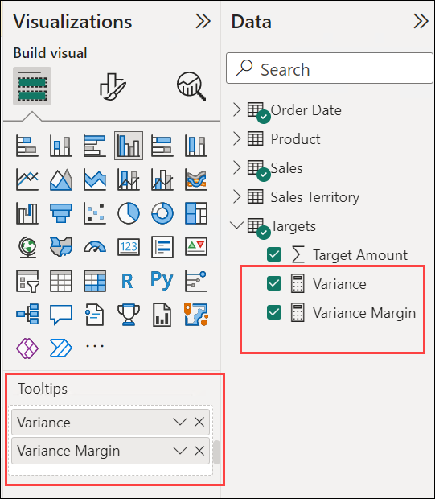
   
1. Hover the cursor over any column to reveal a tooltip, and notice that it shows the measure values.

    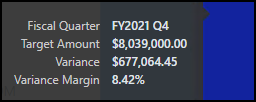

    >**Note**: You have now completed the creation of a composite model that combines DirectQuery and import tables. You could optimize the model to improve query performance by setting dimension tables to use dual storage mode, and by adding aggregations. However, those enhancements will be the learning objective of other labs.*
    
 
### Task-9: Finish up

In this task, you will finish up.

1. Save the Power BI Desktop file.

    
    
1. Close Power BI Desktop.

   **Congratulations** on completing the task! Now, it's time to validate it. Here are the steps:
     > - Navigate to the Lab Validation Page, from the upper right corner in the lab guide section.
     > - Hit the Validate button for the corresponding task. If you receive a success message, you can proceed to the next task. 
     > - If not, carefully read the error message and retry the step, following the instructions in the lab guide.
     > - If you need any assistance, please contact us at labs-support@spektrasystems.com.
