# Lab10 - Improve performance with hybrid tables

## Overview

In this lab, you will set up incremental refresh and enable a DirectQuery partition to deliver real time updates and improve refresh and query performance.

In this lab, you learn how to:

- Set up incremental refresh.

- Review table partitions.

## Exercise 1: Set up the Azure SQL Database

### Task 1: Set up the Azure SQL Database

In this task, you will set up the Azure SQL Database to allow connections from your virtual machine's (VM's) IP address.

1.  If you are not logged in already, click on the Azure portal shortcut that is available on the desktop and log in with the below Azure credentials or skip to **step 3**.
    * Azure Username/Email: <inject key="AzureAdUserEmail"></inject> 
    * Azure Password: <inject key="AzureAdUserPassword"></inject>

2. If prompted to take a tour, select **Maybe later**.

	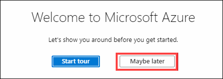

3. On the Azure portal select the **SQL databases** tile.

	

4. In the list of SQL databases, select the **AdventureWorksDW2022-DP500** database.
  
   >**Note**: If you're not able to see **AdventureWorksDW2022-DP500** database, kindly wait for 5-10 mins and try to refresh the page.
 
5. In the action bar on the Overview tab, select **Set server firewall**.

	

6. On the public access tab, review that **Selected networks** are selected, if not please select it.

7. Select **Add your client IPv4 address**.

	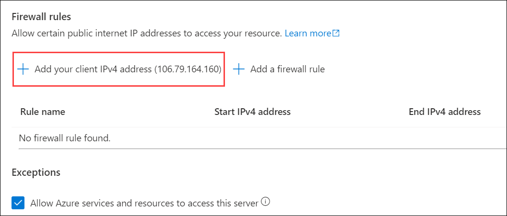

8. Select **Save**.

9. Keep the Azure portal web browser session open. You will need to copy the database connection string in the **Set up Power BI Desktop task**.

### Task 2: Set up Power BI

#### Task 2.1: Set up a Power BI account in Power BI Desktop

In this task, you will set up Power BI Desktop.

1. To open File Explorer, on the taskbar, select the **File Explorer** shortcut.

	

1. Go to the **C:\LabFiles\DP-500-Azure-Data-Analyst\Allfiles\10\Starter** folder.

1. To open a pre-developed Power BI Desktop file, double-click the **Sales Analysis - Improve performance with hybrid tables** file.

1. Select **X** located at the top-right of the getting started window.

      

1. If you're not already signed in, at the top-right corner of Power BI Desktop, select **Sign In**. Use the lab credentials to complete the sign-in process.

	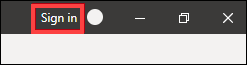
	
1. Enter the Lab username in the **Enter your email address** and click on **Continue**

      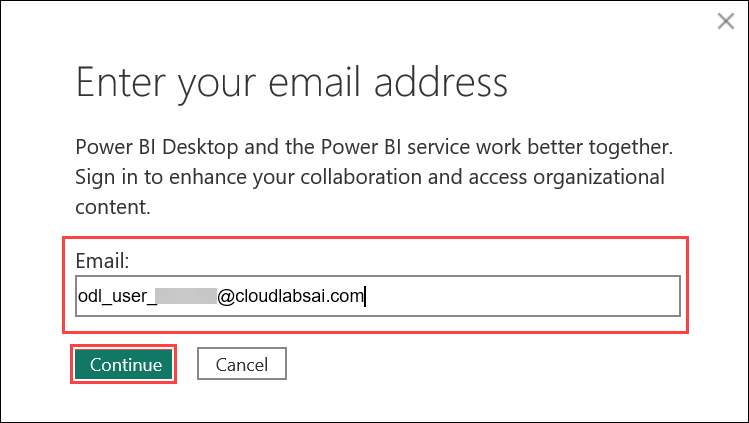
      
1. If Prompted Select **work or school (1)** account and click **contiune (2)** on Let's get you signed in page.

      
	
1. Complete the sign up process by providing username and password:

     * Email/Username: <inject key="AzureAdUserEmail"></inject>

     * Password: <inject key="AzureAdUserPassword"></inject>

#### Task 2.2: Set up Power BI Premium trial

You will sign into the Power BI service and start a trial license in this task.

1. In a web browser, go to [https://powerbi.com](https://powerbi.com/) in case it is not opened.

1. You will be redirected to the Power BI sign-up page in Microsoft Edge. Select **contiune**.

     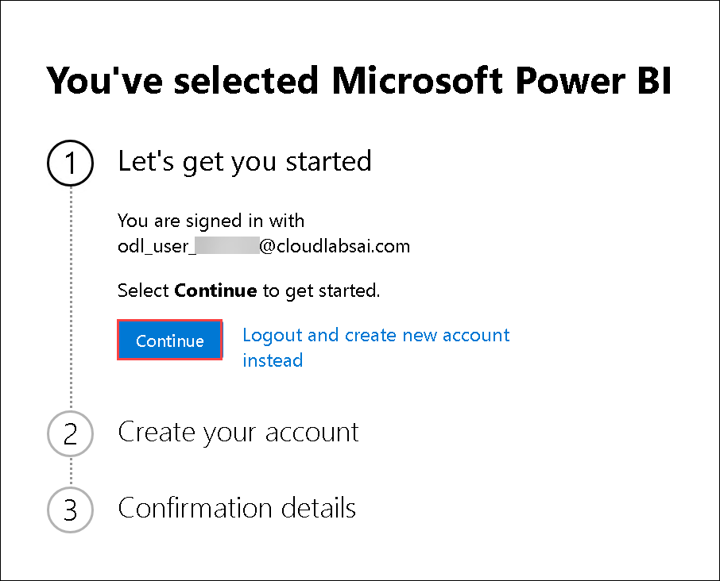
     
1. If prompted **Signin** with following Username and Password.

    * Email/Username: <inject key="AzureAdUserEmail"></inject>

    * Password: <inject key="AzureAdUserPassword"></inject>
	
1. If stay signed in window Pops-up, select **No**

1. Select your **Country/Region** and enter a 10 digit **phone number** and select **Get started**.

     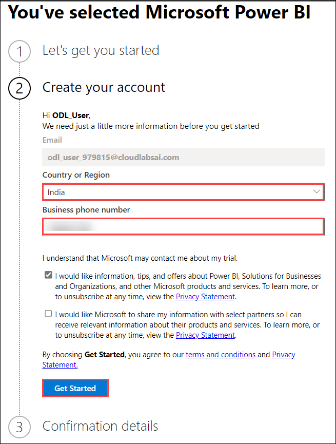

1. Select **Get started** once more. You will be redirected to Power BI.

    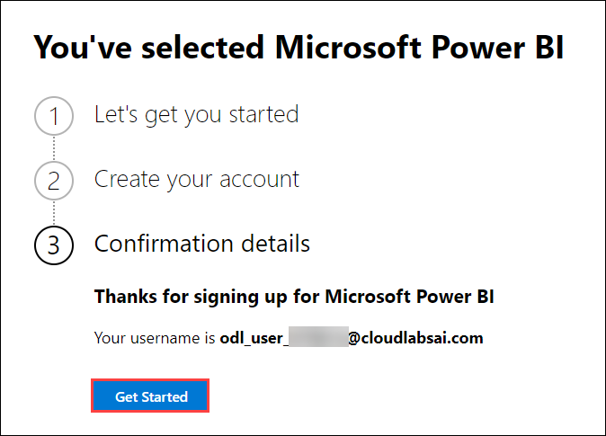

1. At the top-right, select the **profile icon (1)**, and then select **Start trial (2)**.

      

1. When prompted, again select **Start trial**.

      

	>**Note**: You require a Power BI Premium per User (PPU) license to complete this lab. A trial lic ense is sufficient. 

1. Do any remaining tasks to complete the trial setup.

	**Tip**: The Power BI web browser experience is known as the **Power BI service**.

### Task 3: Create a workspace

In this task, you will create a workspace.

1. In the Power BI service, to create a workspace, fron the left **Navigation** pane (located at the left), select **Workspaces (1)**, and then select **+ New workspace (2)**.

	

2. In the **Create a workspace** pane (located at the right), in the **Workspace name** box, enter a name for the workspace as **DP500-<inject key="Deployment ID" enableCopy="false" />**.

	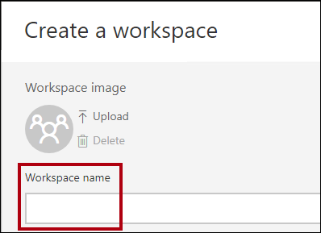
	
	>**Note**: The workspace name must be unique within the tenant.

3. Beneath the **Description** box, expand and open the **Advanced** section.

	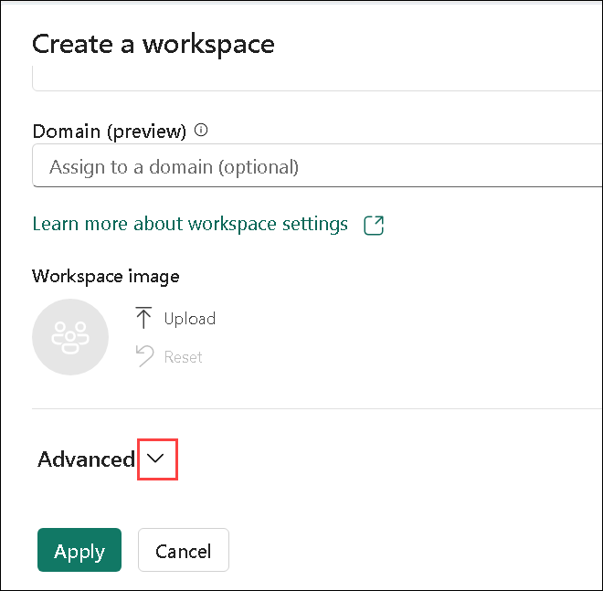

4. Set the **License mode** option to **Premium per-user (1)**. Click **Apply**.

	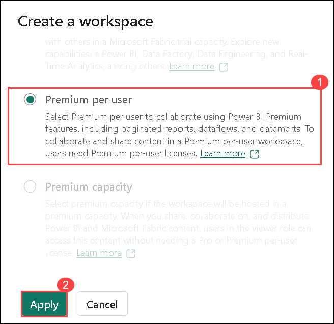

	>**Note**: Power BI only supports incremental refresh and hybrid tables in Premium workspaces.
	>**Note**: Once created, the Power BI service opens the workspace. You will return to this workspace later in this lab.

### Task 4: Set up Power BI Desktop

In this task, you will open a pre-developed Power BI Desktop solution, set the data source settings and permissions, and then refresh the data model.

1. To open File Explorer, on the taskbar, select the **File Explorer** shortcut.

	

2. Go to the **C:\LabFiles\DP-500-Azure-Data-Analyst\Allfiles\10\Starter** folder.

3. Double-click the **Sales Analysis - Improve performance with hybrid tables.pbix** file to open a pre-developed Power BI Desktop file.

4. To edit the database data source, on the **Home** ribbon tab, from inside the **Queries** group, select the **Transform data (1)** dropdown, and then select **Data source settings (2)**.

	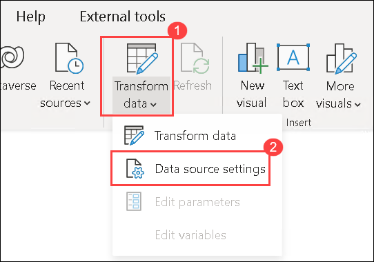

5. On the **Data source settings** window, select **Change Source**.

      .png)

6. On the **SQL Server database** window, in the **Server** box, replace the text with the lab Azure SQL Database server name. This is in the Azure portal, SQL databases.

   .png)

7. Select **OK**.

    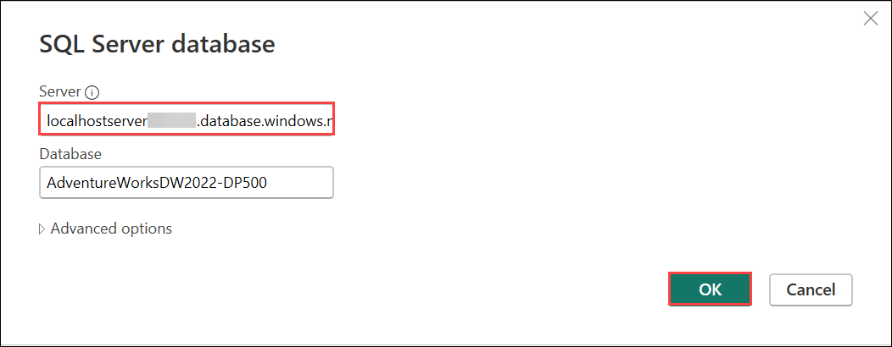

8. On the **Data source settings** window, select **Edit Permissions**.

    .png)

9. In the **Edit Permissions** window, to edit the database credentials, select **Edit**.

	.png)

10. In the **SQL Server database** window, select **Database (1)** and  enter the SQL Server database username and password and click **save (4)**. 

    Username: `sqladmin` **(2)**

    Password: `P@ssw0rd01`  **(3)**

    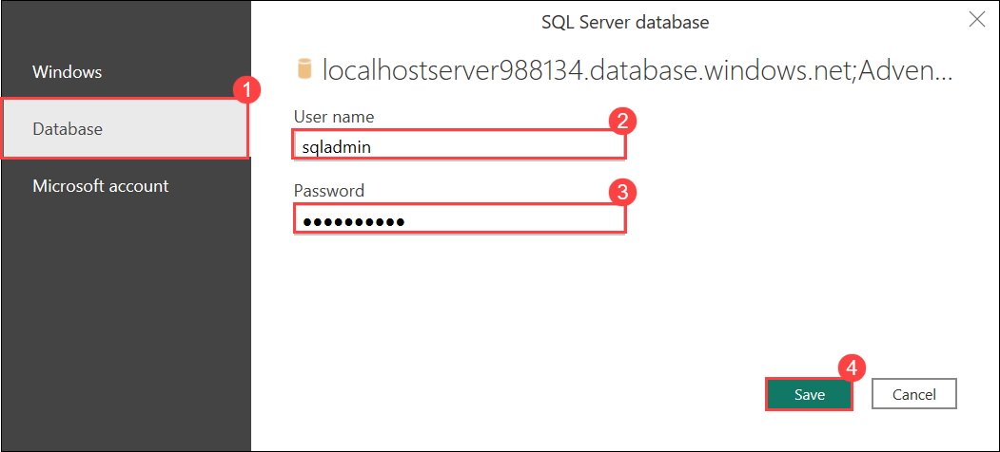
    
11. On the **Edit Permissions** window, select **Ok**.
    
12. On the **Data source settings** window, select **Close**.

13. On the **Home** ribbon tab, from inside the **Queries** group, select **Refresh**.

	 .png)
	 
14. Wait until the data refresh completes.

15. To save the file, on the **File** ribbon tab, select **Save as**.

16. In the **Save As** window, go to the **C:\LabFiles\DP-500-Azure-Data-Analyst\Allfiles\10\MySolution** folder.

17. Select **Save**.

    >**Note**: If it asks for a replacement, please select ok to save.

### Task 5: Review the report

In this task, you will review the pre-developed report.

1. In Power BI Desktop, review the report design.

	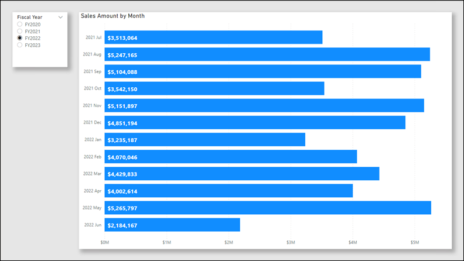

	>**Note**: The report page has a title and two visuals. The slicer visual allows filtering by a single fiscal year, while the bar chart visual displays monthly sales amounts. In this lab, you will improve the performance of the report by setting up incremental refresh and a hybrid table.

### Task 6: Review the data model

In this task, you will review the pre-developed data model.

1. Switch to **Model** view.

	

2. Use the model diagram to review the model design.

	.png)

	>**Note:** The model comprises five dimension tables and one fact table. Each table uses import storage mode. The **Sales** fact table represents sales order details. It's a classic star schema design.
	>In this lab, you will set up the **Sales** table to use an incremental refresh and become a hybrid table. A hybrid table includes a DirectQuery partition that represents the latest time period. That partition ensures current data from the data source is available in Power BI reports.

      **Congratulations** on completing the task! Now, it's time to validate it. Here are the steps:

      > - Navigate to the Lab Validation Page, from the upper right corner in the lab guide section.
      > - Hit the Validate button for the corresponding task. If you receive a success message, you can proceed to the next task. 
      > - If not, carefully read the error message and retry the step, following the instructions in the lab guide.
      > - If you need any assistance, please contact us at labs-support@spektrasystems.com. 
    
## Exercise 2: Set up incremental refresh.

In this exercise, you will set up incremental refresh.

Incremental refresh extends scheduled refresh operations by providing automated partition creation and management for dataset tables that frequently load new and updated data. It helps to reduce refresh time, placing lower burdens on source data and Power BI. It can also help surface current data to Power BI report more quickly.

### Task 1: Add parameters

In this task, you will add two parameters.

1. To open the Power Query Editor window, on the **Home** ribbon tab, from inside the **Queries** group, click the **Transform data** icon.

	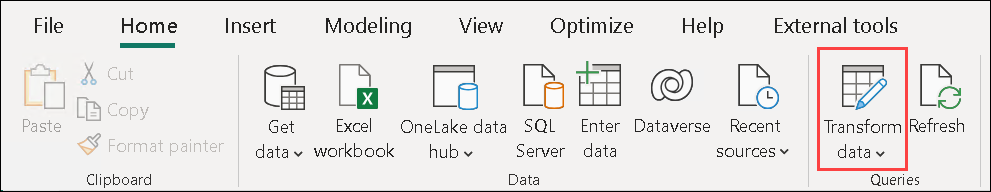

2. In the Power Query Editor window, from inside the **Queries** pane, select the **Sales** query.

	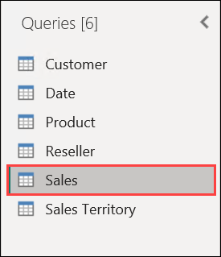

3. In the preview pane, notice the **OrderDate** column, which is a date/time column.

	>**Note**: Incremental refresh requires that the table contain a date column of date/time or integer data type with the value formatted as yyyymmdd.
	>**Note**: To set up incremental refresh, you must create parameters that Power BI will use to filter this column to create table partitions.

4. To create a parameter, on the **Home** ribbon tab, select the **Manager Parameters** icon.

	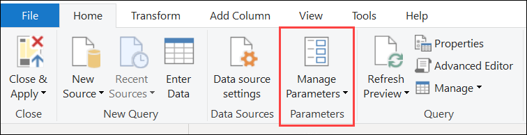

5. In the **Manage Parameters** window, select **New**.

	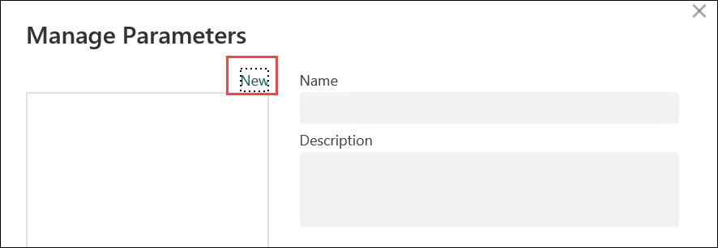

6. In the **Name** box, replace the text with **RangeStart (1)**.

7. In the **Type** dropdown list, select **Date/Time (2)**.

8. In the **Current Value** box, enter **6/1/2022 (3)** (June 1, 2022 - the VM uses US date formats). 

	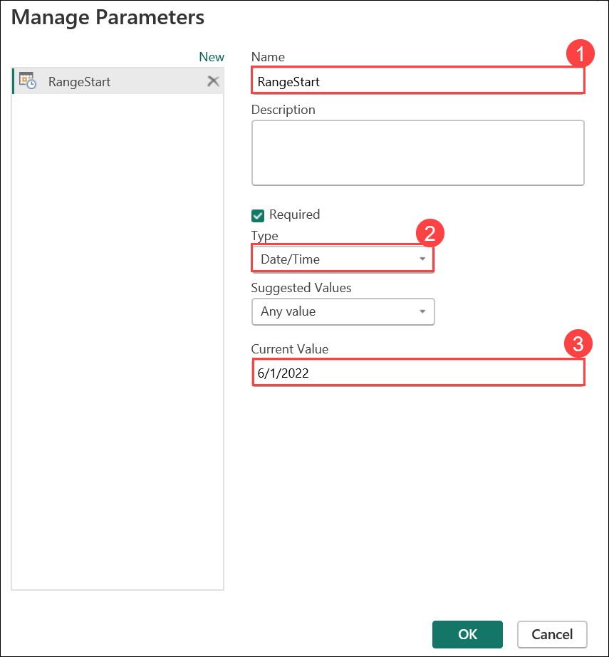
	
	>**Note**: For non-MM-DD-YYY format locations, the date should be entered as 1/6/2022.
        >**Note**: While setting up the parameters, you can use arbitrary values. Power BI will update parameter values when it creates and manages the partitions. In this lab, you'll set a range for the month of June 2022.

9. To create a second parameter, select **New**.

10. Set the following parameter properties and click **OK (4)**.

	- Name: **RangeEnd (1)**

	- Type: **Date/Time (2)**

	- Current Value: **7/1/2022 (3)** (July 1, 2022)
	
	  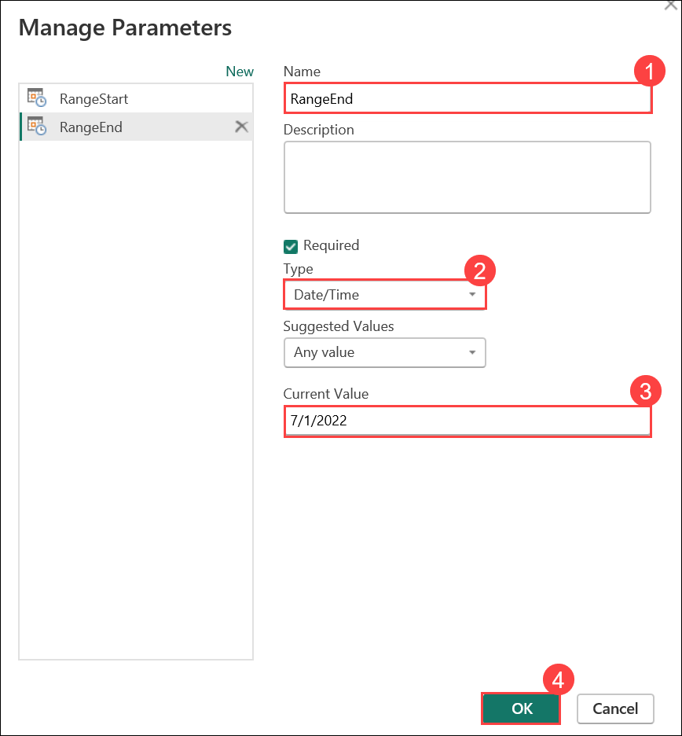
	
	  >**Note**: For non-MM-DD-YYY format locations, the date should be entered as 1/7/2022.

### Task 2: Filter the query

In this task, you will add filters to the **Sales** query.

1. In the **Queries** pane, select the **Sales** query.

2. In the header of the **OrderDate (1)** column, select the down arrow, and then select **Date/Time Filters (2)** > **Between (3)**.

	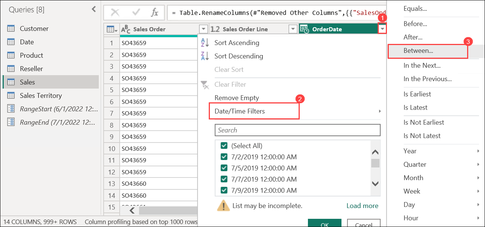

3. In the **Filter Rows** window, select the **first calendar icon** **(1)** dropdown list, and then select **Parameter (2)**, In the adjacent dropdown list, notice that the **RangeStart (3)** parameter is set. 

      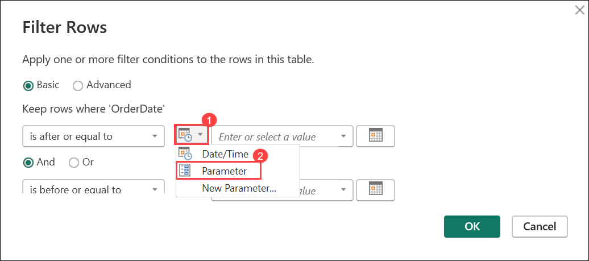
      
      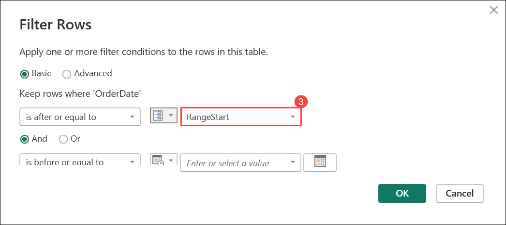
	
5. In the second "range" dropdown list, select **is before (1)**. select the **second calendar icon (2)** dropdown list, select **Parameter** and in the corresponding dropdown lists, select the **RangeEnd (3)** parameter. Select **OK (4)**.

	

	>**Note**: The default parameter selection is the correct one.

4. On the **Home** ribbon tab, from inside the **Close** group, click the **Close &amp; Apply** icon.

	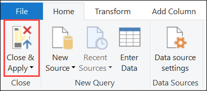

5. Notice that Power BI Desktop loaded 5,134 rows into the **Sales** table.

	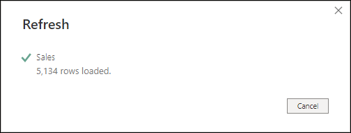

	>**Note**: These are the filtered rows for June 2022.

6. Save the Power BI Desktop file.

	

### Task 3: Set up incremental refresh

In this task, you will set up the incremental refresh policy for the **Sales** table.

1. In the model diagram, right-click the **Sales** table header, and then select **Incremental refresh**.

	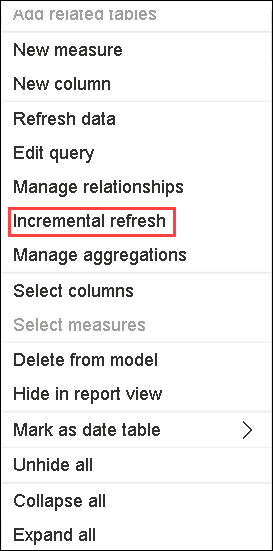
	
2. In the **Incremental refresh and real-time data** window, at step 2, turn on **Incrementally refresh this table (1)**. Set the Archive data starting **2 Years (2)** before the refresh date. Set an Incrementally refresh data starting **7 Days (3)** before the refresh date. At step 3, **check** the **Get the latest data in real time with the DirectQuery (4)** option. Select **Apply (5)**.

      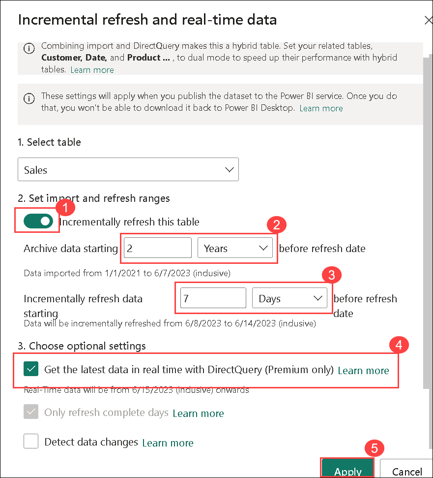
      
	>**Note:Archive sata starting:** This setting determines the historical period. In this instance, Power BI will create two whole-year partitions for historic data.

	>**Note:Incrementally refresh data starting:** This setting determines the incremental refresh period in which all rows with a date/time in that period are included in the refresh partition(s) and refreshed with each refresh operation.

	> **Note:Get the latest data in real time with DirectQuery** This setting enables fetching the latest changes from the selected table at the data source beyond the incremental refresh period by using DirectQuery. All rows with a date/time later than the incremental refresh period are included in a DirectQuery partition and fetched from the data source with every dataset query. This setting makes the table a hybrid table because it will contain import partitions and one DirectQuery partition.

3. **Save** the Power BI Desktop file.

    

### Task 4: Publish the dataset

In this task, you will publish the dataset.

1. To publish the report, on the **Home** ribbon tab, select **Publish**.

	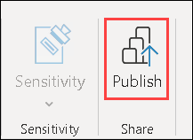

2. On the **Publish to Power BI** window, select the workspace **DP500-<inject key="Deployment ID" enableCopy="false" />** **(1)** created in this lab, and then **select (2)**.

	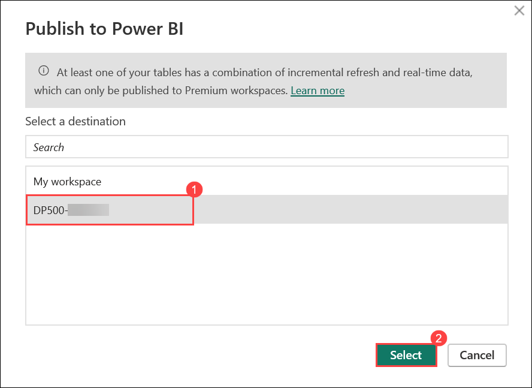

3. When the publishing succeeds, select **Got it**.

	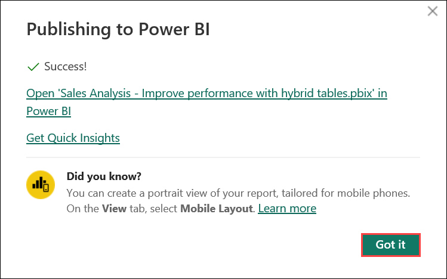

4. Close Power BI Desktop.

5. If prompted to save changes, select **Save**.

### Task 5: Set up the dataset

In this task, you will set up the data source credentials and refresh the dataset.

1. Switch to the Power BI service web browser session.

2. In the workspace landing page, locate the report and dataset.

	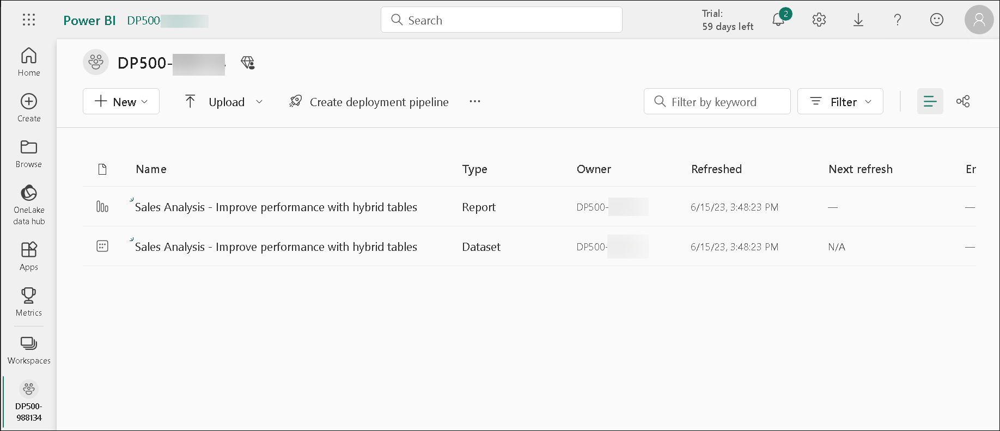

3. Hover the cursor over the dataset, and when the ellipsis appears, select the ellipsis, and then select **Settings**.

	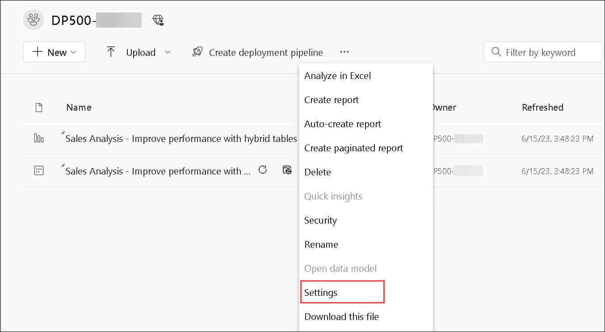

4. On **Datasets** tab under the **Data source credentials** section (you need to scroll down to see option), select the **Edit credentials** link.

	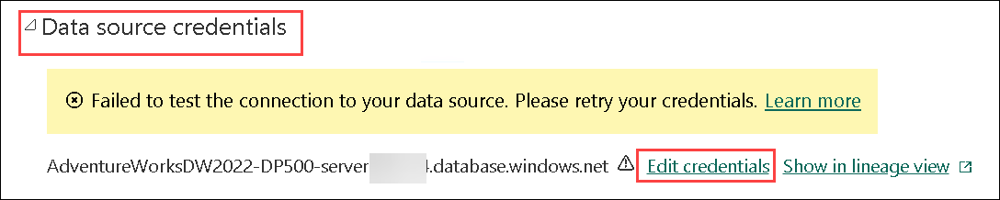

5. In the window, enter the username and password, and set the privacy level to **Organizational (3)**. Select **Sign In (4)**.
       
      Username: `sqladmin` **(1)**

      Password: `P@ssw0rd01` **(2)**

    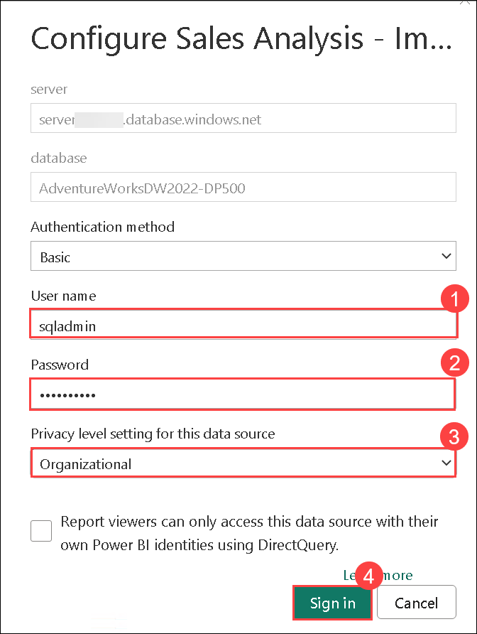
    
6. Expand open the **Scheduled refresh and performance optimization** section.

     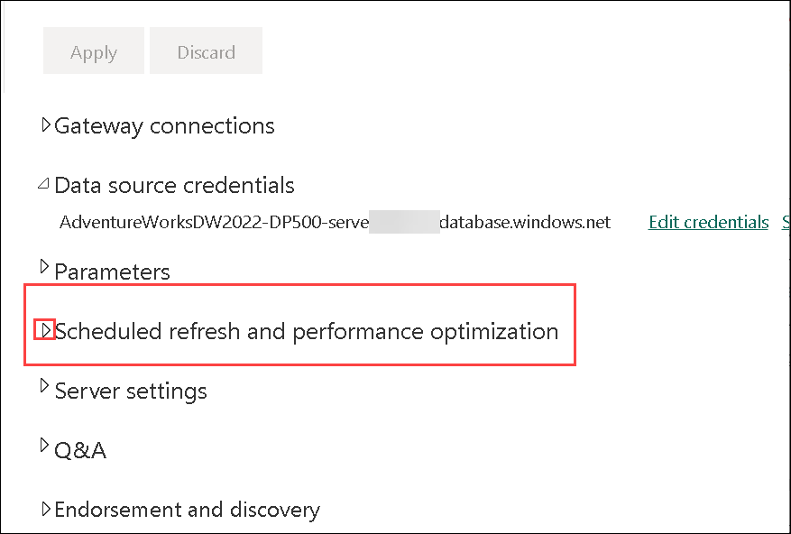
	
7. Notice, but do not change, any of the settings.

	>**Note**: In a real world set up, you schedule data refresh to allow Power BI to refresh and manage the partitions on a recurring basis.
	>**Note**: In this lab, you will do an on-demand refresh.

8. In the **Navigation** pane (located at the left), select **Workspaces (1)** and select the workspace **DP500-<inject key="Deployment ID" enableCopy="false" />** **(2)**.

   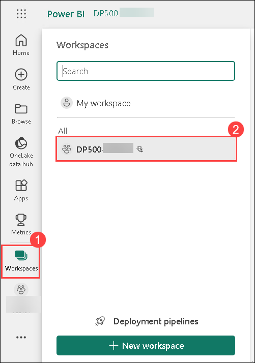

9. In the workspace landing page, hover the cursor over the dataset, and then select the **Refresh** icon.

	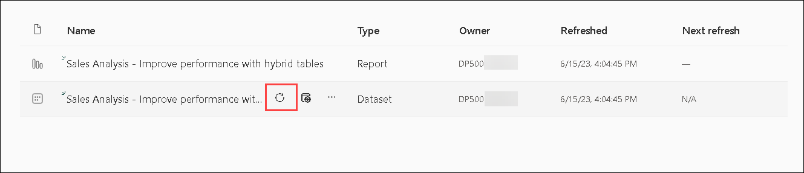

10. In the **Refreshed** column, notice the spinning icon, and wait until it stops (indicating that the refresh has completed).

	

11. To open the workspace settings, at the top select ellipsis, select **Workspace Settings**.

	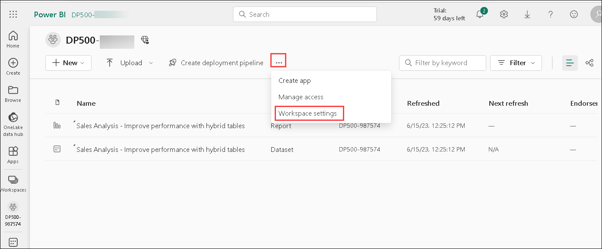

12. In the **Workspace Settings** pane, select the **Premium (1)** tab. To copy the workspace connection to the clipboard, select **Copy (2)**.

	

	>**Note**: You will use the workspace connection to connect to it in SQL Server Management Studio (SSMS).

13. To close the pane, select **X**.

### Task 6: Review the table partitions

In this task, you will use SSMS to review the table partitions.

1. To open SSMS, on the desktop, select the **SSMS** shortcut.

	

2. In the **Connect to Server** window, in the **Server type** dropdown list, select **Analysis Services**. In the **Server name** box, replace the text by pasting in the workspace connection (press **Ctrl+V**).In the **Authentication** dropdown list, select **Azure Active Directory - Password**. 
 
      - Enter Azure Username/Email: <inject key="AzureAdUserEmail"></inject> 
      - and Azure Password: <inject key="AzureAdUserPassword"></inject>
      - Select **Connect**.

        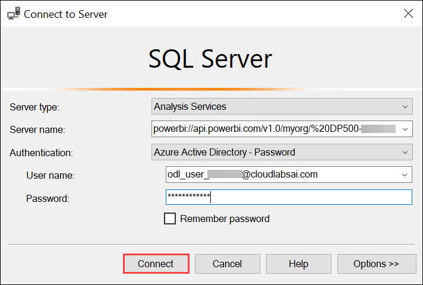
     
        >**Note**: You can use SSMS to connect to the workspace by using the XMLA read/write endpoint. The endpoint is only available for Premium workspaces.
    
3. In Object Explorer (located at the left), expand the **Databases** folder, expand the **Sales Analysis...** database (dataset), and then the **Tables** folder.

	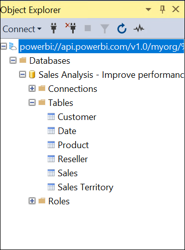

4. Right-click the **Sales** table, and then select **Partitions**.

	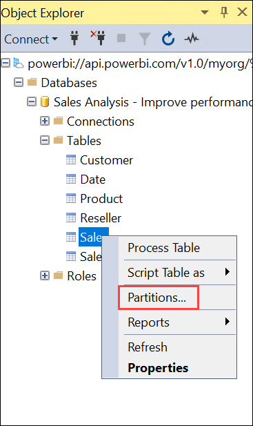

5. In the **Partitions** window, notice the list of partitions for the two years’ history, followed by quarterly partitions and daily partitions.

6. Scroll to the bottom of the list and notice the last one is a DirectQuery partition for the current and future dates.

	>**Note**: Power BI creates and manages all of these partitions automatically.

7. Select **Cancel**.

## Exercise 3: Test the hybrid table

In this exercise, you will open the report, add a sales order, and then see the report data update.

### Task 1: Open the report

In this task, you will open the report.

1. Switch to the Power BI service web browser session.

2. In the workspace landing page, select the report.

	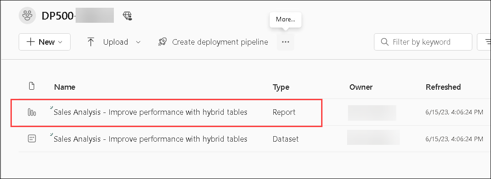

3. If necessary, in the **Fiscal Year** slicer, select the fiscal year that contains the current month (based on today's date).

	  >**Note**: The current month should be visible as a bar in the bar chart.
	  >**Note**: August 2022 onwards is not in FY 2022, which is the default for the slicer.

### Task 2: Add an order to the database

In this task, you will add an order to the database.

1. Switch to SSMS.

2. To open a script file, on the **File** menu, select **Open** > **File**.

3. In the **Open File** window, go to the **C:\LabFiles\DP-500-Azure-Data-Analyst\Allfiles\10\Assets** folder.

4. Select the **1-InsertOrder (1)** file and select **Open (2)**.

	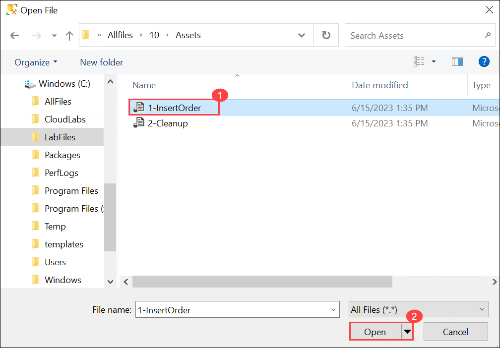

5. In the **Connect to Database Engine** window, in **Server name** box enter **serverDID.database.windows.net**.

    >**Note**: Replace **DID** with **<inject key="DeploymentID" enableCopy="true" />**

6. In the **Authentication** dropdown list, select **SQL Server Authentication**.

7. Enter the Login username **sqladmin** and password `P@ssw0rd01`.

8. Select **Connect**.

	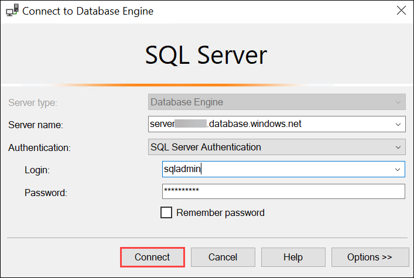

9. Review the script.

	>**Note**: This script inserts a single order into the **FactInternetSales** table using today as the order date.
	
10. Select **AdventureWorksDW2022-DP500** from the **Available Databases** dropdown list.

	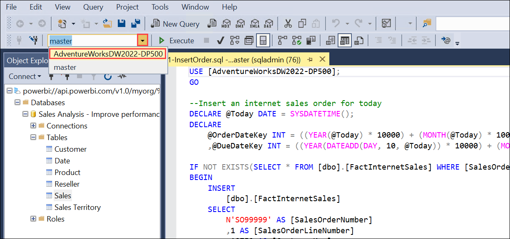

11. To run a script, on the toolbar, select **Execute** (or press **F5**).

	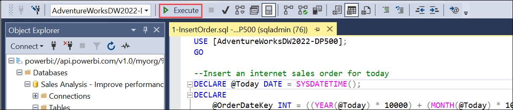

12. To close the file, on the **File** menu, select **Close**.

### Task 3: Refresh the report

In this task, you will refresh the report.

1. Switch to the Power BI service web browser session.

2. In the report, take note of the sales amount for the current month.

3. On the action bar, select the **Refresh** command (at top right corner).

    

4. When the report refresh completes, verify that the sales amount for the current month increased by $10,000 dollars.

	>**Note**: When Power BI queried the **Sales** table, it retrieved current data from the DirectQuery partition, which queried the Azure SQL database directly.

	>**Tip**: Hybrid tables work especially well with automatic page refresh, which is a feature that automatically refreshes a Power BI report.
	
   **Congratulations** on completing the task! Now, it's time to validate it. Here are the steps:

   > - Navigate to the Lab Validation Page, from the upper right corner in the lab guide section.
   > - Hit the Validate button for the corresponding task. If you receive a success message, you can proceed to the next task. 
   > - If not, carefully read the error message and retry the step, following the instructions in the lab guide.
   > - If you need any assistance, please contact us at labs-support@spektrasystems.com. We are available 24/7 to help you out.

	
